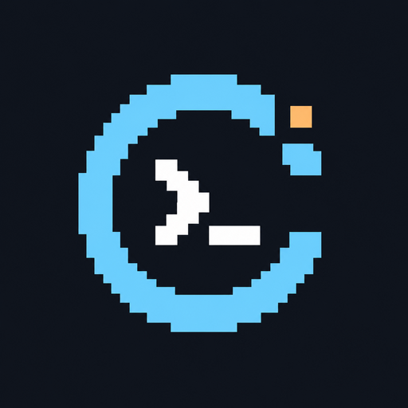

# CPCéleste — Identité de marque

Décision produit du 4 octobre 2026, pour l’alpha 0.13. Éditeur : **AstroWare Conception**.

## Nom et positionnement

**CPCéleste** associe CPC et « céleste » : les idées, l’exploration et l’univers AstroWare. Prononciation conseillée : « cé-pé-céleste ». Casse officielle : CPC en capitales, éleste en minuscules, accent conservé. Identifiant ASCII de marque : `cpceleste`.

Signature : **Vos idées prennent vie en BASIC.** Descripteur : **L’atelier Locomotive BASIC pour Amstrad CPC.** Signature internationale possible : *Bring your BASIC ideas to life.*

Le produit s’adresse aux passionnés de CPC, auteurs de jeux et curieux souhaitant retrouver la programmation BASIC avec des outils modernes. Ton clair, enthousiaste, précis ; vocabulaire d’atelier et de création. L’IA est un compagnon de programmation contrôlé, pas une promesse de logiciel infaillible. Ne pas annoncer « émulateur intégré opérationnel » avant sa qualification. Toujours afficher le statut alpha quand il s’applique.

La recherche exploratoire web a écarté Locomotif et LocoForge, déjà employés par des projets logiciels. Aucune correspondance d’IDE CPCéleste n’a été identifiée dans les résultats consultés ; cela n’établit ni disponibilité juridique, ni réservation de domaine. Aucun dépôt de marque ou achat n’a été effectué. Le nom de fabricant décrit la plateforme ciblée, sans affiliation revendiquée ni reprise de son logo.

## Symbole et composition

L’orbite cyan dessine un C pixelisé ; l’invite blanche `>_` représente le code ; le carré ambre évoque une étoile et une idée nouvelle. La silhouette réunit rétro-informatique et exploration sans reprendre les emblèmes d’un constructeur. Le nom reste un texte vivant dans l’interface : lisible, accessible, indépendant des pixels du logo.

| Usage | Fichier / règle |
| --- | --- |
| Icône de l’application et symbole de marque | [PNG 512 × 512](../../apps/desktop/public/brand/cpceleste-icon.png), fond bleu nuit, opaque |
| Favicon | [PNG 64 × 64](../../apps/desktop/public/brand/cpceleste-favicon.png) |
| Planche de marque imprimable | [HTML autonome](../../apps/desktop/public/brand/identity.html), ouvrir puis imprimer en PDF depuis le navigateur |
| En-tête IDE | Symbole 56 px, mot-symbole textuel CPCéleste, signature puis version et éditeur |
| Zone de protection | Au moins un quart de la largeur du symbole autour d’un logo isolé |
| Taille minimale | Symbole 32 px ; favicon 16 px ; en dessous, lisibilité à vérifier selon support |

Ne pas étirer, faire pivoter, ajouter de halo ou recolorer arbitrairement. Sur fond clair, conserver le carré bleu nuit. Pas de version transparente ou vectorielle revendiquée : les fichiers livrés sont raster. Le logo ne remplace pas un libellé de bouton. Dans l’en-tête, `alt=""` évite de doubler le nom accessible porté par le titre.

## Palette et typographie

| Couleur | Hex | Fonction |
| --- | --- | --- |
| Bleu nuit | `#10151D` | Fond, écrin du symbole |
| Cyan orbital | `#74D4FF` | Marque, sélection, repères actifs |
| Ambre stellaire | `#FFBE76` | Accent rare, étoile du symbole |
| Blanc de lecture | `#E4EBF3` | Titres et texte principal |
| Gris bleu | `#94A9BB` | Métadonnées et légendes |

Typographie d’interface : `system-ui, sans-serif`, sans téléchargement ni nouvelle dépendance. Code : pile monospace locale utilisée par Monaco. Les lettres CPC sont plus fermes, « éleste » cyan plus léger. Éviter une police rétro sur les textes longs ; le pixel est réservé au symbole.

## Intégration et continuité

Le titre HTML, la fenêtre Electron, l’en-tête, la favicon et la documentation d’entrée portent CPCéleste. Vite copie le dossier public dans le renderer ; Electron lit l’icône depuis ce build. Les chemins d’assets relatifs fonctionnent aussi sous `file://`, sans accès réseau et sans élargissement de la CSP.

Le dépôt GitHub, le package `micro-ide-amstrad`, les noms de manifestes, caches, fichiers temporaires et le stockage Electron existant ne changent pas. Pas de migration de projets ou de perte de configuration au titre du changement de marque. Les rapports historiques restent des preuves datées, pas des textes à réécrire globalement. La roadmap fonctionnelle continue avec identité Git, commits et historique.

## Fabrication et vérification

Symbole original généré avec l’outil intégré de génération d’images, puis décliné techniquement à 512/64 px sans retouche créative. L’original généré reste conservé dans les pièces de travail ; le dépôt inclut les dérivés utiles, sans nouvelle dépendance runtime. La palette est la référence de mise en page, pas une garantie que chaque pixel de l’image générée a exactement cette valeur.

Prompt final : « Standalone square app icon for CPCéleste, independent modern Amstrad CPC BASIC IDE by AstroWare Conception. No text. Midnight navy background #10151D; thick cyan #74D4FF C-shaped orbit with stepped 8-bit corners, white coding chevron and underscore, one amber #FFBE76 square star at upper right. Centered isolated geometric emblem, generous margin, legible at 32px, no borrowed logos, shadows or mockup. »

Les recettes existantes navigateur et Electron contrôlent le nouveau titre et le chargement effectif du logo tout en rejouant les parcours métier. Leur exécution et les captures sont consignées dans la PR ; le changement de marque ne qualifie aucune fonction supplémentaire.
