# CPCéleste — Vos idées prennent vie en BASIC

**L’atelier Amstrad CPC qui réunit le plaisir de créer sur une machine mythique et le confort d’un IDE moderne.**

[Retour au README](../README.md) · [Premiers pas](#premiers-pas) · [Exécuter avec F5](#execution) · [Agent IA](#agent) · [Raccourcis](#raccourcis) · [Dépannage](#depannage)

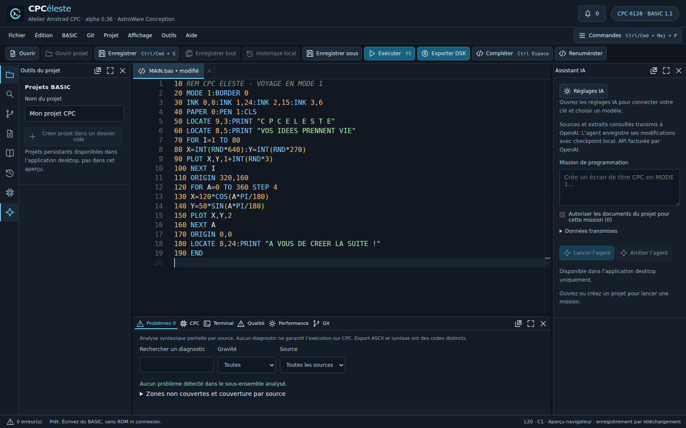

Il suffit parfois d’un `MODE 1`, de quelques couleurs et d’une idée pour retrouver cette sensation : un ordinateur qui attend votre programme, un écran qui vous appartient, un monde à inventer. **CPCéleste donne à cette liberté les outils d’aujourd’hui.** Écrivez avec la complétion et les diagnostics, explorez plusieurs sources, lancez votre programme dans le CPC intégré, retrouvez une ancienne version, demandez à un agent de construire une première proposition et emportez votre création sur disquette DSK.

Le fil conducteur est simple : **garder la création au centre, raccourcir le chemin entre une idée et son résultat, et vous laisser comprendre ce que l’outil fait.** Le BASIC reste du BASIC, vos sources restent des fichiers texte et votre projet reste un dossier que vous pouvez conserver, déplacer et versionner.

Cette notice présente les fonctions livrées dans **CPCéleste 0.39.1, alpha desktop**, au **7 octobre 2026**. Elle réunit découverte du produit et mode d’emploi. Les captures représentent l’interface réelle ; celles issues des recettes automatisées utilisent des données de démonstration. Leur [provenance détaillée](images/guide-utilisateur/README.md) distingue captures locales, Electron et services distants simulés. Cliquez sur une image pour l’ouvrir en grand dans GitHub.

<a id="sommaire"></a>
## Votre parcours dans la notice

| Découvrir | Créer et améliorer | Conserver et partager |
| --- | --- | --- |
| [Ce qui fait sa singularité](#singularite) | [L’éditeur BASIC](#editeur) | [Enregistrement et récupération](#sauvegardes) |
| [À qui s’adresse CPCéleste ?](#public) | [Diagnostics et navigation](#diagnostics) | [Git local](#git) |
| [Installation et premier projet](#premiers-pas) | [Recherche et renumérotation](#transformations) | [Branches, remotes et GitHub](#github) |
| [Repères dans l’atelier](#atelier) | [Exécution et inspection CPC](#execution) | [Disquettes et portabilité](#dsk) |
| [Projets et explorateur](#projets) | [Agent et documents](#agent) | [Confidentialité](#confidentialite) |
| [Personnalisation](#personnalisation) | [Qualité et performance](#qualite) | [Dépannage et limites](#depannage) |

<a id="singularite"></a>
## 1. Un atelier pensé pour la création CPC

CPCéleste associe des fonctions rarement réunies dans un même parcours de programmation rétro. Sa singularité tient à leur articulation : vous pouvez travailler sur votre programme, comprendre ses références, l’améliorer et préparer son support de diffusion sans quitter votre atelier.

| Votre envie | La réponse de CPCéleste | Ce que vous y gagnez |
| --- | --- | --- |
| Retrouver immédiatement le résultat de vos idées | **Exécuter / F5** construit le disque depuis les buffers et ouvre le CPC 6128 intégré | Une boucle écrire → essayer → ajuster, même avant d’enregistrer |
| Écrire du BASIC avec du confort | Coloration, complétion, fiches, diagnostics, cibles navigables et onglets | Moins de recherches mécaniques, davantage d’attention au programme |
| Faire évoluer un listing devenu encombré | Renumérotation avec aperçu et mise à jour des références couvertes | Une transformation contrôlable et annulable |
| Être accompagné dans une création | Agent OpenAI à outils, références BASIC et documents autorisés | Des modifications réelles des fichiers, un journal et un retour arrière |
| Comprendre un code ancien ou dense | Rapport de qualité local, métriques et remarques navigables | Des pistes concrètes de relecture sans consommation IA |
| Oser expérimenter | Annulation, historique local, copies de brouillons et checkpoints | Plusieurs moyens de retrouver votre travail |
| Construire un projet qui vous ressemble | Thèmes, accents, profils, raccourcis et panneaux ajustables | Un environnement adapté à votre manière de programmer |
| Partager et continuer ailleurs | Sources texte, Git/GitHub et export DSK | Une création qui conserve son indépendance |

**Vous pouvez utiliser l’éditeur et construire un DSK sans ROM et sans clé IA.** Les ROM locales deviennent nécessaires pour exécuter la machine ; la clé personnelle devient nécessaire pour les fonctions OpenAI. Vous choisissez les services dont vous avez besoin.

<a id="public"></a>
## 2. Pour les passionnés, les créateurs et les transmetteurs

**Vous retrouvez le CPC après des années ?** Commencez par un listing, retrouvez les commandes et testez vos souvenirs avec les fiches et le panneau Problèmes. L’atelier vous aide à reprendre vos repères tout en conservant les numéros de ligne, les commandes et les contraintes de la machine.

**Vous créez un jeu, une démonstration ou un écran de titre ?** Organisez plusieurs programmes, joignez votre cahier d’intentions, utilisez un agent pour explorer une première solution et vérifiez le résultat dans le CPC. Les commandes graphiques restent dans le code ; vous gardez la main sur chaque détail.

**Vous enseignez ou accompagnez un débutant ?** Alternez explication, lecture du code, navigation entre les cibles et observation à l’écran. Les rapports de qualité ouvrent la discussion sur la lisibilité, les répétitions et les embranchements. Les sources et les rapports peuvent circuler indépendamment de l’IDE.

**Vous aimez les habitudes des IDE actuels ?** Palette, ouverture rapide, recherche multisource, diff, Git, terminal et raccourcis configurables vous offrent des repères familiers. La base de raccourcis inspirée de JetBrains facilite la transition sans prétendre reproduire tout un IDE généraliste.

<a id="premiers-pas"></a>
## 3. Installer CPCéleste et créer votre premier programme

### Télécharger la preview prête à lancer

Depuis la version 0.38.1, des paquets Windows et Linux sont disponibles. Consultez le [guide de téléchargement](implementation/packaging-preview-alpha.md#telecharger) pour récupérer l’installateur Windows, la version portable, l’AppImage ou le paquet Debian. **Vous n’avez pas besoin d’installer Node.js, npm ou Python pour utiliser ces paquets.**

Pour essayer rapidement sous Windows : téléchargez l’archive Windows, extrayez-la, puis ouvrez `CPCeleste-Portable-0.38.1.exe`. Pour une installation classique, utilisez `CPCeleste-Setup-0.38.1.exe`. Cette preview n’est pas signée et les ROM CPC restent à importer localement pour exécuter vos programmes.

### Construire l’alpha depuis le dépôt

La version actuelle se lance comme une application de bureau construite depuis les sources. Prévoyez **Node.js 24.12 ou supérieur dans la branche 24**, **Python 3.12 ou supérieur** et **Git**, accessibles dans votre terminal.

```bash
git clone https://github.com/AstrowareConception/Micro-IDE-Amstrad.git
cd Micro-IDE-Amstrad
npm ci --ignore-scripts
node node_modules/electron/install.js
npm run build:desktop
npm start
```

Le premier build prépare le moteur CPC en WebAssembly et télécharge son outillage. Cette étape demande Internet et peut être sensiblement plus longue que les suivantes. Le moteur préparé est ensuite réutilisé. **Aucune ROM n’est téléchargée par ces commandes de préparation.** Le [guide de construction](implementation/emulator-run-alpha.md) explique le cache, le choix d’un compilateur externe et les réglages Windows.

Des archives de build sont également produites par le workflow [Desktop editor](https://github.com/AstrowareConception/Micro-IDE-Amstrad/actions/workflows/editor.yml). L’archive `cpceleste-desktop-alpha` contient le build, son manifeste et ses dépendances verrouillées ; après extraction, `npm ci` puis `npm start` permettent son lancement. Il s’agit encore d’une alpha Node/Electron : l’installateur autonome signé et les mises à jour automatiques font partie des évolutions à venir.

Windows est la plateforme prioritaire du produit ; des builds Windows et des recettes Electron Linux existent. Les fonctions particulières gardent les limites de qualification décrites dans leurs guides. La disponibilité des sources ne constitue pas une qualification complète sous macOS.

### Votre première session, étape par étape

1. Lancez CPCéleste : un exemple BASIC est déjà ouvert.
2. Choisissez **Fichier → Créer un projet**, donnez-lui un nom et sélectionnez un dossier vide. Vous pouvez aussi saisir le nom dans les outils Projet et utiliser **Créer projet dans un dossier vide**.
3. Le projet contient une première source `src/main.bas`. Remplacez son contenu par l’exemple ci-dessous.
4. Utilisez **Enregistrer** ou `Ctrl/Cmd + S`.
5. Consultez **Problèmes** : un clic sur une remarque rejoint sa position dans le code.
6. Pour essayer le programme, importez vos trois ROM dans **ROM du CPC 6128**, puis utilisez **Exécuter / F5**.
7. Pour emporter votre création, choisissez **Exporter DSK** et une destination hors du dossier de projet.

```basic
10 MODE 1
20 BORDER 0:INK 0,0:INK 1,24
30 PAPER 0:PEN 1:CLS
40 LOCATE 9,10:PRINT "BONJOUR CPC !"
50 LOCATE 5,13:PRINT "A VOUS DE CREER LA SUITE"
60 END
```

Les chaînes de cet exemple restent en ASCII pour l’export actuel. Vous pouvez également ouvrir le dossier d’exemple [hello-cpc](../examples/hello-cpc/README.md) avec **Ouvrir projet**.

### Ouvrir seulement un listing

**Ouvrir** charge un fichier BASIC texte UTF-8. Vous disposez de l’édition, de l’enregistrement, d’**Enregistrer sous**, des diagnostics, de la renumérotation et de l’export DSK. Pour bénéficier des sources multiples, des documents, de l’agent et des fonctions associées au dossier, créez ou ouvrez un projet.

`npm run dev:editor` lance un **aperçu navigateur de l’éditeur** utile au développement de l’interface. Il enregistre par téléchargement et ne remplace pas l’application desktop pour les projets persistants, Git, l’agent ou les ROM.

<a id="atelier"></a>
## 4. Prendre ses repères dans l’atelier

L’organisation accompagne le geste de programmation : **outils à gauche, code au centre, assistant à droite, résultats en bas**. La barre principale conserve les commandes fréquentes, dont l’exécution et l’export.

| Zone | À quoi elle sert |
| --- | --- |
| Menus Fichier, Édition, BASIC, Git, Projet, Affichage, Outils, Aide | Retrouver les actions par intention |
| Barre d’actions | Ouvrir, enregistrer, consulter l’historique, renuméroter, exécuter et exporter |
| Outils du projet | Sources, explorateur, recherche, documents, Git, références et ROM selon la vue choisie |
| Onglets et éditeur central | Passer d’une source à l’autre en conservant curseur et annulation |
| Assistant IA | Saisir une mission, suivre son activité et examiner les changements |
| Sorties | Problèmes, CPC, terminal, qualité, performance et journal Git |
| Tests BASIC (0.39.1) | Suites persistantes, scénarios clavier, fixtures texte, observations écran/fichier et historique |
| Cloche et bande de notification | Retrouver les retours de l’atelier et rejoindre leurs détails |
| Barre d’état | Position du curseur et contexte courant |

### La palette : votre accès direct à l’action

`Ctrl/Cmd + Maj + P` ouvre la palette de commandes. Recherchez une action par son libellé, puis exécutez-la au clavier. Les raccourcis courants sont affichés et les actions indisponibles conservent leur explication ou leur état désactivé.

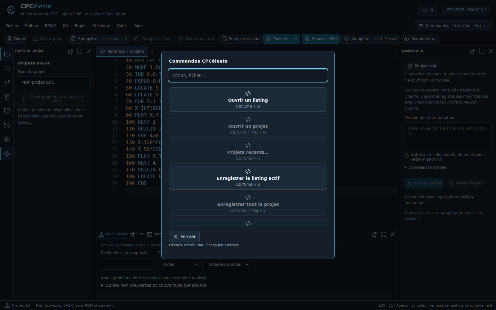

`Ctrl/Cmd + P` ouvre rapidement les sources. Les menus contextuels de l’éditeur et des onglets, ainsi que le bouton **⋯** d’une source, rapprochent les commandes de l’endroit où vous travaillez. L’aide aux raccourcis reflète votre configuration.

### Un espace de travail ajustable

Faites glisser les séparateurs pour dimensionner les outils, l’assistant et les sorties. Les panneaux peuvent être **détachés dans l’espace de l’IDE**, déplacés, redimensionnés, agrandis puis réancrés. Leurs positions sont conservées. Ce sont des panneaux flottants internes, pas des fenêtres système indépendantes.

Le menu **Affichage** propose les dispositions **Édition**, **Exécution** et **Agent**. Choisir Exécution affiche l’espace adapté sans démarrer le CPC. Le **mode Concentration** masque les outils périphériques et restitue ensuite leur disposition précédente. **Restaurer la disposition des panneaux** permet de retrouver une organisation exploitable.

<a id="projets"></a>
## 5. Donner une structure à vos créations

### Un dossier, plusieurs sources, un point d’entrée

Un projet réunit un manifeste `microide.project.json` et ses sources BASIC. Les chemins restent relatifs au dossier : vous pouvez déplacer le projet puis le rouvrir. Le nom historique « Micro IDE Amstrad » demeure dans certains identifiants techniques ; le nom du produit est CPCéleste.

**Ajouter source** attend un nom de 1 à 8 lettres ASCII, chiffres ou underscores, sans extension. `INTRO` devient `src/intro.bas` et portera le nom `INTRO.BAS` sur la disquette. Le projet peut déclarer jusqu’à **64 sources**. Les onglets affichent les modifications non enregistrées et conservent leur propre pile d’annulation.

Sélectionnez **Définir comme entrée** sur la source que F5 doit lancer. Les autres sources restent présentes sur le disque. **Un projet multifichier n’assemble pas automatiquement les listings** : chaque fichier reste un programme BASIC indépendant. À vous d’utiliser les commandes BASIC adaptées à leur chargement et à leur enchaînement.

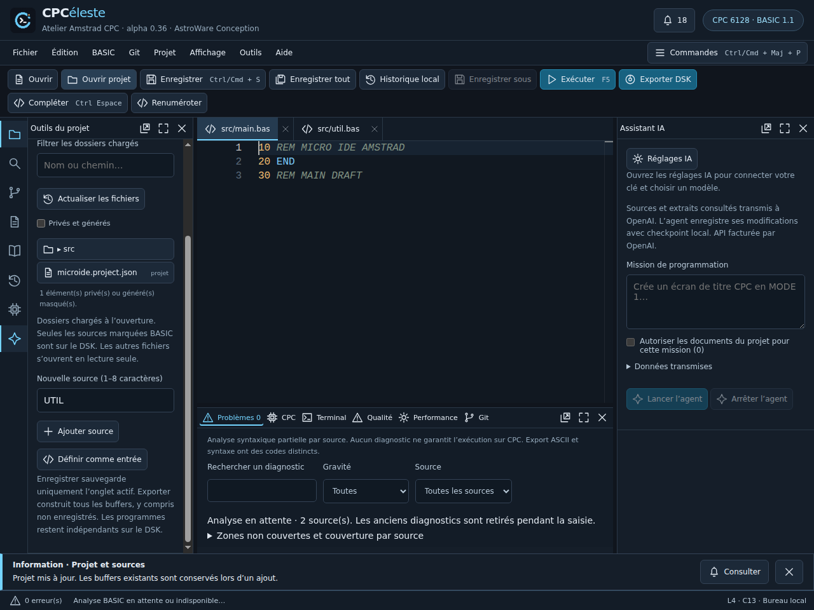

### Explorer les vrais fichiers du projet

L’explorateur affiche l’arborescence réelle, charge les dossiers à la demande et propose **Actualiser les fichiers**. Son filtre porte sur les dossiers déjà chargés. Sources déclarées et documents importés rejoignent leurs vues dédiées ; un fichier texte ordinaire peut s’ouvrir dans un aperçu en lecture seule.

Les fichiers privés et générés sont masqués par défaut. La case **Privés et générés** permet de les afficher volontairement. Les brouillons des sources sont signalés. Voir un fichier dans l’explorateur **ne l’ajoute pas à la disquette** : le manifeste détermine les sources du DSK.

L’aperçu des fichiers ordinaires est borné à 64 Kio ; il ne devient pas un éditeur universel. La création de dossiers depuis l’interface et l’import/duplication générale de sources restent à compléter. Un déplacement vise un dossier déjà existant sous `src/`.

### Renommer, déplacer et supprimer avec aperçu

Dans **Projet**, la palette ou les actions de source, choisissez **Renommer cette source**, **Déplacer cette source** ou **Supprimer cette source**. Examinez le chemin, le nom CPC et le point d’entrée proposés, puis confirmez dans le dialogue natif.

- **Renommer** change le nom de fichier et le nom CPC, tout en conservant l’identité du buffer, le curseur et l’undo.
- **Déplacer** change le chemin sous `src/`, dans un dossier existant, en conservant le nom CPC.
- **Supprimer** retire la source et sa déclaration. La dernière source du projet reste protégée.
- Si une source à supprimer contient un brouillon, choisissez de **conserver le brouillon et supprimer**, ou d’**enregistrer puis supprimer**.
- **Rétablir la dernière organisation** remet fichiers et manifeste dans leur état précédent si le projet correspond encore aux préconditions attendues.
- **Consulter le brouillon conservé** permet de lire et copier la dernière version archivée même lorsque le rétablissement est devenu périmé.

Le renommage ne réécrit pas les noms de fichiers contenus dans vos chaînes BASIC. Si votre programme contient `RUN"INTRO.BAS"`, vérifiez cet appel après le renommage d’INTRO.

### Retrouver les projets récents

**Fichier → Projets récents**, ou `Ctrl/Cmd + R`, retrouve les **20 derniers projets** avec nom, dossier, date et filtre. Retirer une entrée de cette liste ne supprime pas le projet. Un dossier déplacé ou indisponible est signalé ; rouvrez-le depuis sa nouvelle destination pour reprendre le travail.

<a id="editeur"></a>
## 6. Écrire du Locomotive BASIC avec le confort moderne

Le centre de CPCéleste est un éditeur Monaco adapté au BASIC numéroté : coloration, sélection, annuler/rétablir, recherche, indentation et affichage réglable. Vos listings restent du texte UTF-8 ; l’export applique ses propres contraintes d’encodage CPC.

### Complétion, documentation et navigation

**`Ctrl + Espace`** affiche les suggestions : commandes et fonctions du catalogue, identifiants observés et cibles BASIC connues. Survolez une commande pour consulter sa fiche ; **F1** et la vue de référence donnent accès à l’aide disponible. Les fiches s’appuient sur le corpus Locomotive BASIC fourni au projet, avec provenance.

**F12** rejoint une cible littérale connue, par exemple la ligne visée par un `GOTO` ou un `GOSUB` couvert. Les cibles calculées et le chargement d’un autre programme demandent une lecture plus large du code. Le catalogue d’aide et l’analyse sont progressifs : ils ne constituent pas encore un manuel interactif exhaustif de toutes les formes du langage.

### Les gestes de code qui accélèrent le travail

Le menu Édition et la palette donnent accès à **commenter/décommenter les lignes**, **dupliquer une ligne**, **déplacer une ligne vers le haut ou le bas**, **supprimer une ligne** et **ajouter la prochaine occurrence à la sélection**. La recherche et le remplacement dans le listing courant utilisent les outils Monaco ; **Aller à une ligne physique** rejoint directement une position du fichier. Ces gestes complètent la recherche multisource spécifique à CPCéleste. **Alt + clic** ajoute un curseur, **Maj + clic** étend la sélection, le double clic sélectionne un mot et le triple clic une ligne. **Ctrl + clic** sur une cible BASIC connue rejoint sa définition. Un clic molette sur un onglet ferme sa vue en conservant le buffer dans l’atelier.

### Deux numérotations à connaître

Les nombres de la gouttière sont les **lignes physiques de l’éditeur**. Les nombres écrits dans le listing sont les **numéros BASIC**. Un diagnostic peut donc indiquer « L8 · BASIC 100 » : huitième ligne du fichier, instruction BASIC numérotée 100. Changer l’affichage des numéros physiques dans les paramètres ne renumérote jamais le programme.

### Un travail continu d’un onglet à l’autre

Les onglets conservent texte, position et undo. Une fermeture d’onglet n’implique pas nécessairement l’abandon du buffer conservé par l’atelier : les panneaux d’analyse peuvent encore le référencer et le rouvrir lors d’une navigation. Enregistrer, fermer et changer de projet restent des actions distinctes ; les confirmations protègent les modifications en attente.

<a id="diagnostics"></a>
## 7. Repérer les erreurs et comprendre leur emplacement

Les diagnostics accompagnent la saisie. Après une pause d’environ **200 ms**, un worker analyse les sources modifiées, en donnant la priorité à la source active. Les sources inchangées ne sont pas reparsées à chaque mouvement du curseur ou changement de panneau. Les anciens diagnostics sont retirés pendant l’attente pour éviter de présenter une position périmée comme actuelle.

Le panneau **Problèmes** regroupe les résultats des sources chargées, brouillons compris. Il indique fichier, ligne physique, colonne, numéro BASIC lorsqu’il existe, gravité et code. Combinez recherche, gravité et source pour réduire la liste. Un clic ou Entrée sélectionne la plage concernée ; **F8** et **Maj + F8** parcourent les diagnostics entre fichiers.

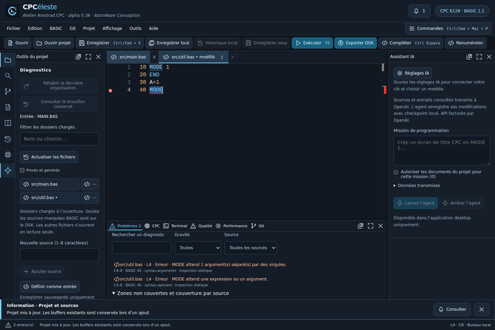

Les contrôles couvrent notamment :

| Famille | Exemples de vérifications |
| --- | --- |
| Structure du listing | Numéros, ordre, références littérales et cibles absentes |
| Expressions et affectations | Opérateurs, parenthèses, valeurs manquantes, affectations et listes |
| Tableaux et boucles | Formes de DIM, READ, NEXT, FOR et WHILE |
| Conditions et branchements | IF simple, THEN/ELSE couverts, sélecteurs ON et certaines formes de timers |
| Commandes CPC | Signatures de commandes graphiques, mémoire, entrées/sorties, son et fichiers simples |
| Sortie texte et saisie | Certaines formes de PRINT, WRITE et INPUT |
| Export | Contraintes d’encodage ASCII identifiées séparément |

Dépliez **Zones non couvertes et couverture par source** pour connaître les limites. Des constructions restent partielles ou opaques, notamment certains IF imbriqués, types, arités de fonctions, flux complexes, RSX et cibles calculées. **Zéro diagnostic signifie qu’aucun problème n’a été détecté par les contrôles disponibles ; le CPC reste l’épreuve d’exécution.** En cas d’échec du worker, **Réessayer l’analyse** conserve vos buffers et leur undo.

<a id="transformations"></a>
## 8. Retrouver et transformer votre code

### Rechercher et remplacer dans plusieurs sources

Ouvrez **Édition → Rechercher dans toutes les sources**, ou `Ctrl/Cmd + Maj + F`.

1. Saisissez le texte recherché et choisissez **Respecter la casse** ou **Mot entier** si nécessaire.
2. Lancez **Rechercher toutes les sources** : les buffers chargés sont inclus, même non enregistrés.
3. Cliquez sur un résultat pour rejoindre son occurrence exacte.
4. Saisissez le remplacement puis choisissez **Prévisualiser les remplacements**.
5. Examinez les aperçus avant/après et décochez les fichiers à préserver.
6. Appliquez les remplacements sélectionnés ; `Ctrl/Cmd + Z` les annule dans la source active.

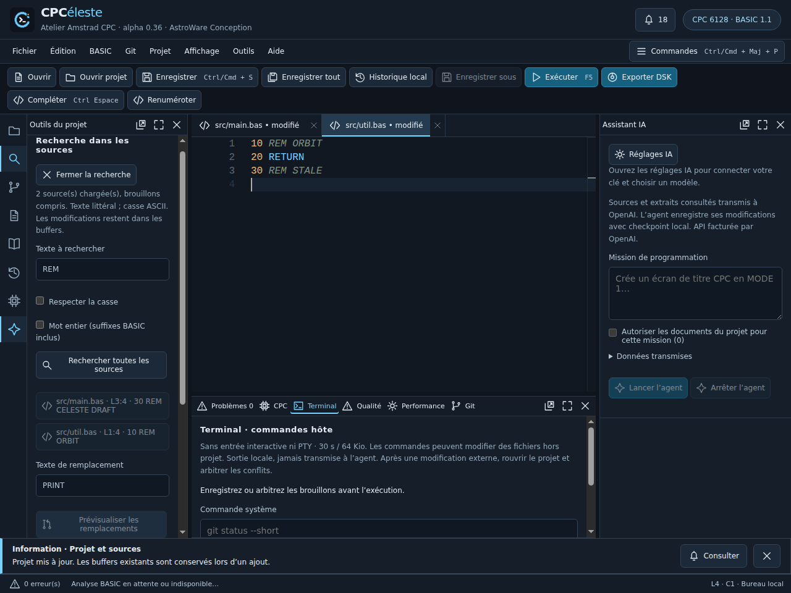

La recherche est littérale, avec options de casse et de mot entier ; elle inclut les chaînes et commentaires. Elle ne propose pas encore les expressions régulières et ne parcourt pas les documents joints ou tous les fichiers du disque. Une modification du contenu invalide l’aperçu : relancez la recherche avant application. L’annulation est indépendante par source. Le remplacement agit sur les buffers ; l’enregistrement demeure une étape distincte, sous réserve de votre réglage d’auto-save.

### Renuméroter sans perdre le fil des branchements

Une séquence de lignes trop serrée peut freiner l’écriture. **Renuméroter** vous permet de choisir un premier nouveau numéro, un pas et une plage d’anciens numéros. L’aperçu présente les substitutions et le résultat avant toute application.

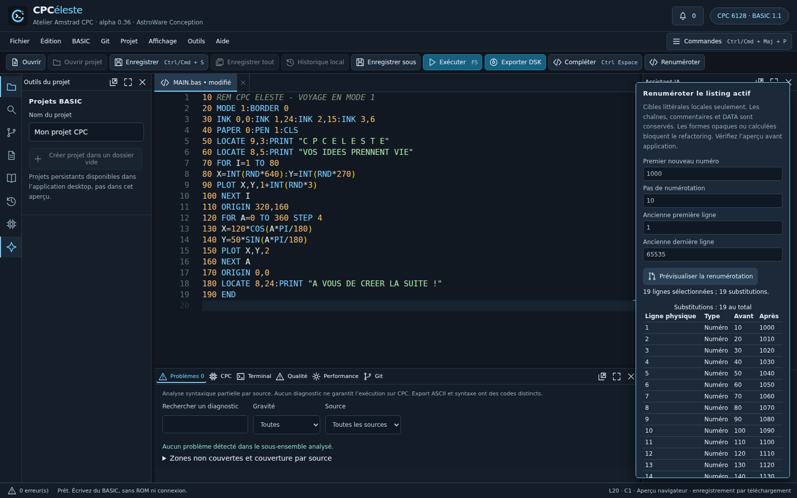

1. Ouvrez **Renuméroter** dans la barre, le menu BASIC ou la palette.
2. Définissez les numéros et la plage souhaités.
3. Utilisez **Prévisualiser la renumérotation** et lisez les avertissements.
4. Appliquez : le buffer actif change en une opération annulable.
5. Vérifiez le résultat, puis enregistrez lorsque vous êtes prêt.

Les références locales littérales couvertes sont mises à jour, y compris des références placées hors de la plage vers une ligne renumérotée : `GOTO`, `GOSUB`, `THEN/ELSE`, listes `ON`, certaines formes événementielles, `RESTORE`, `RESUME` et `RUN`. Les chaînes, commentaires et données restent préservés.

Une collision, une cible certaine absente ou une construction dont l’interprétation n’est pas suffisamment sûre bloque le plan. Des cibles calculées et certaines formes opaques demandent une intervention manuelle. Cette prudence protège votre intention : la renumérotation est une transformation contrôlée, pas une promesse d’équivalence pour tout programme imaginable.

<a id="execution"></a>
## 9. F5 : voir votre programme vivre dans le CPC

**C’est le cœur du parcours créatif.** Le bouton **Exécuter / F5** prend les buffers courants, prépare un DSK et démarre l’écran CPC 6128 dans l’atelier. Vous pouvez essayer une idée avant de l’enregistrer : aucun export manuel préalable n’est nécessaire.

### Préparer les ROM une seule fois

Dans **ROM du CPC 6128**, importez trois fichiers séparés de **16 384 octets** : **OS 6128**, **BASIC 1.1** et **AMSDOS**. L’IDE vérifie les fichiers et leurs empreintes, puis retrouve la sélection au redémarrage. Les ROM restent dans le stockage local de l’application, hors du projet, du DSK et du contexte IA.

Une taille correcte ne suffit pas à identifier le rôle d’une ROM. Un firmware manquant ou corrompu bloque le lancement avec une explication ; **Configurer les ROM** vous ramène aux imports. Le produit ne fournit pas de firmware tiers.

### Lancer et observer

Sur le jeu anglais de référence reconnu, l’écran `Ready` déclenche l’envoi automatique de la commande `RUN` du point d’entrée. Pour un autre jeu, attendez de voir `Ready`, puis cliquez sur **Ready est visible : lancer le programme**.

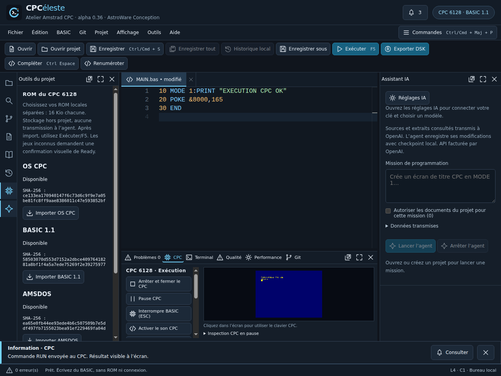

*Capture d’une recette réelle du moteur : le listing de démonstration et l’écran CPC sont visibles dans le même atelier. Le programme affiché ici est volontairement minimal.*

Pour un listing isolé, le fichier lancé est `MAIN.BAS`. Pour un projet, c’est votre point d’entrée. Toutes les sources du projet sont sur le disque, sous leurs noms CPC. Les erreurs BASIC ou AMSDOS apparaissent sur l’écran émulé : l’état « commande envoyée » indique une action effectuée, pas la réussite du programme.

### Piloter la session

| Commande | Effet |
| --- | --- |
| Cliquer dans l’écran CPC | Donner le clavier à la machine : caractères ASCII, Entrée, ESC, suppression et flèches pris en charge |
| **Pause CPC / Reprendre le CPC** | Suspendre ou poursuivre la machine |
| **Interrompre BASIC (ESC)** | Envoyer l’interruption BASIC |
| **Activer / Couper le son CPC** | Activer volontairement l’audio, muet au départ |
| **Taille de l’écran CPC** | Ajuster au panneau ou choisir 100, 150, 200 ou 300 % |
| **Exporter la disquette de session** | Conserver le disque de la machine, avec les écritures CPC effectuées pendant la session |
| **Arrêter et fermer le CPC** | Détruire la session émulée |
| **F5 à nouveau** | Redémarrer une machine propre avec les dernières versions des buffers |

La perte de focus de l’écran relâche les touches. Une fenêtre masquée ou qui perd le focus met la machine en pause. Masquer le panneau CPC dans l’atelier ne remplace pas une commande d’arrêt.

**Avant de relancer F5, exportez les écritures de session que vous voulez conserver.** Modifier le listing ne modifie pas le programme déjà chargé dans la machine ; une relance est nécessaire. Le disque exporté depuis les sources et le disque de session sont deux objets différents.

### Observer les registres et la mémoire

Mettez le CPC en pause, ouvrez **Inspection CPC en pause**, saisissez une adresse hexadécimale (`8000`, `&8000` ou `0x8000`), puis cliquez sur **Lire les registres et la RAM**. La fenêtre affiche jusqu’à 64 octets en hexadécimal et ASCII. La RAM observée est celle des banques actives derrière les ROM ; le registre PC indique une position Z80, pas un numéro de ligne BASIC. Vous pouvez examiner les **registres Z80** et une fenêtre de **RAM logique**, sans lecture permanente en arrière-plan. La reprise retire l’instantané pour ne pas afficher une mémoire périmée comme actuelle.

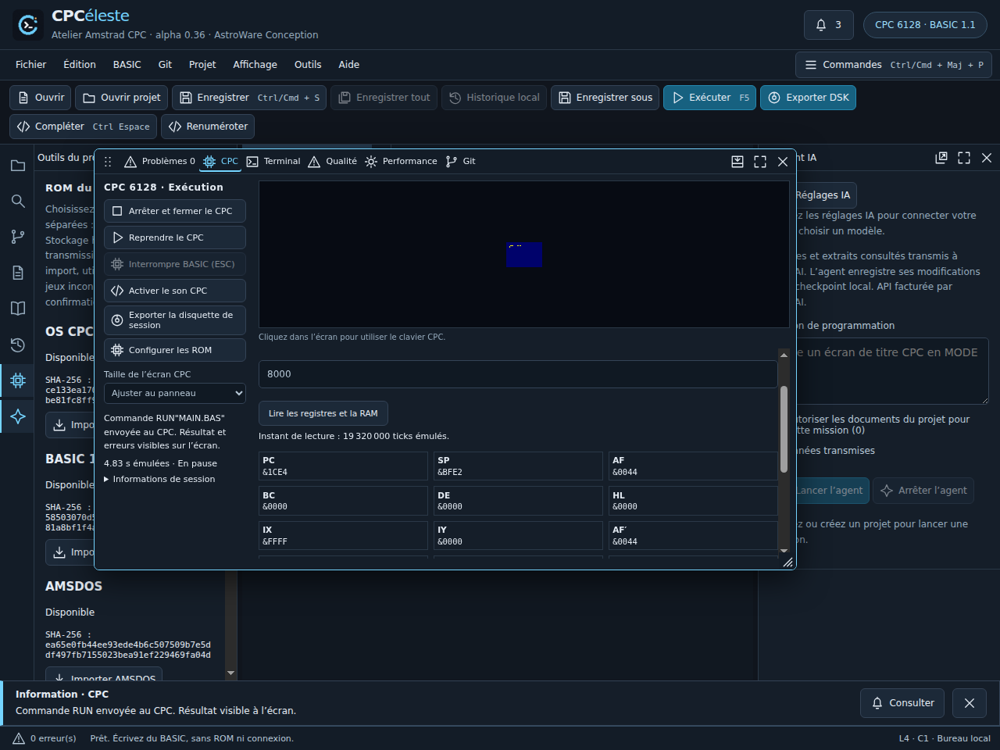

Cette inspection offre un premier regard sous le programme. **Le débogueur BASIC public avec points d’arrêt, pas-à-pas et variables n’est pas encore livré.** L’inspection ne doit pas être confondue avec ces fonctions prévues dans le [plan de débogueur](implementation/basic-debugger-plan.md).

<a id="dsk"></a>
## 10. Exporter une vraie disquette de votre création

**Exporter DSK** prépare une disquette standard au format **AMSDOS DATA** depuis vos sources courantes. L’export utilise les brouillons présents dans les buffers, conserve les noms CPC déclarés et relit la structure du disque produit. Placez la destination hors du dossier du projet.

La préparation encode les listings ASCII ; elle n’effectue ni compilation Z80, ni concaténation des programmes. Dans l’artefact BASIC, les lignes vides sont omises, l’indentation précédant les numéros est retirée et l’espace numéro/instruction peut être normalisé. Le texte de travail reste distinct de cet artefact.

| Élément | Ce qu’il contient | À quoi il sert |
| --- | --- | --- |
| **Dossier projet** | Sources UTF-8, manifeste, ressources et stockage privé selon les fonctions utilisées | Continuer le travail dans l’IDE |
| **DSK exporté** | Listings CPC de la révision des buffers choisie | Emporter les programmes sur un support CPC |
| **DSK de session** | État du disque monté, incluant les écritures effectuées par le CPC | Sauvegarder les résultats d’une session émulée |
| **Rapport qualité** | Mesures, remarques et couverture, sans listing | Relire ou communiquer l’analyse |

L’export ne remplace pas la sauvegarde des sources et ne marque pas les buffers comme enregistrés. Les pièces jointes, les ROM, la clé IA et les historiques ne sont pas intégrés au DSK. Le disque vise un usage extérieur à l’IDE ; la relecture indépendante et la qualification complète sur matériels et émulateurs tiers restent à mener selon la recette du projet.

<a id="sauvegardes"></a>
## 11. Expérimenter avec plusieurs chemins de retour

CPCéleste vous permet d’avancer par essais sans réduire la conservation du travail à une seule commande. Chaque mécanisme répond à un besoin différent.

| Mécanisme | Usage | Point à retenir |
| --- | --- | --- |
| Annuler / rétablir | Revenir sur une édition, un remplacement ou une renumérotation | Pile propre à chaque buffer |
| Enregistrer | Écrire la source active | Les autres brouillons restent distincts |
| Enregistrer tout | Écrire les buffers du projet avec contrôles préalables | Ne concerne pas des fichiers arbitraires du dossier |
| Auto-save facultatif | Enregistrer les sources du projet après une pause de saisie | Écrit réellement sur disque ; désactivé par défaut |
| Historique local | Comparer et reprendre une version de source | Remet la version choisie dans le buffer |
| Copie locale des brouillons | Retrouver une saisie non enregistrée après redémarrage | Fonction à activer ; distincte de l’auto-save |
| Journaux de reprise | Terminer ou rétablir certaines opérations interrompues | Arbitrage explicite à la réouverture |
| Checkpoint agent | Revenir au début de la mission courante | Vérifications de révision avant restauration |
| Git | Construire un historique choisi et le partager | Commits et synchronisations explicites |

### Enregistrer avec des contrôles de cohérence

**Enregistrer** utilise `Ctrl/Cmd + S`. **Enregistrer tout** utilise `Ctrl/Cmd + Maj + S`. L’IDE vérifie les versions connues avant d’écrire : une modification concurrente sur disque demande une revue. Les opérations couvertes par le journal peuvent proposer une reprise après interruption.

Dans **Paramètres → Enregistrement et BASIC**, activez l’auto-save si vous le souhaitez et réglez son délai entre **1 et 60 secondes**. Il concerne les sources des projets, pas les listings isolés. Les missions IA, commandes terminal et opérations disque le suspendent pendant leur activité.

### Comparer les versions de l’historique local

Ouvrez **Historique local**, sélectionnez une version et examinez le diff. **Restaurer cette version dans le buffer** vous permet de la reprendre avec possibilité d’annulation. Enregistrez ensuite si cette version doit devenir la nouvelle version disque.

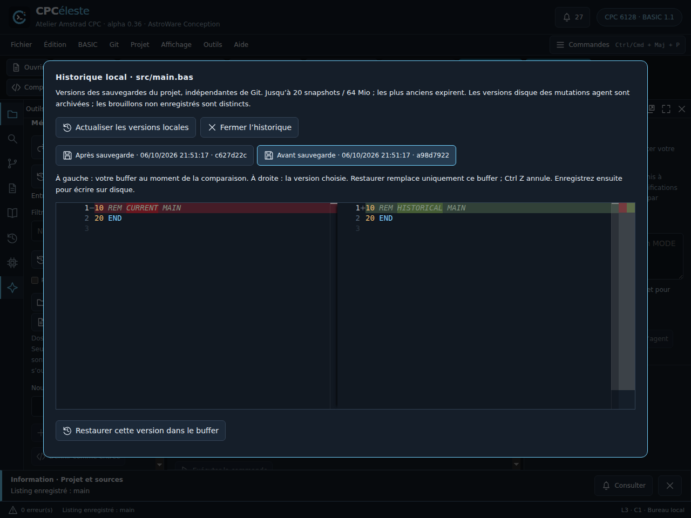

L’historique conserve les versions produites par les sauvegardes et les mutations couvertes, dont celles de l’agent. Sa rétention est bornée à **20 snapshots et 64 Mio** ; ce n’est pas une archive illimitée ni une restauration globale de tous les fichiers d’un projet.

### Retrouver les brouillons

Ouvrez **Brouillons et modifications externes** depuis la palette, puis activez **Copie automatique des brouillons** pour la session. **Copier les brouillons maintenant** permet aussi une copie explicite ; la copie automatique intervient après 2 secondes de pause, avec une vérification toutes les 15 secondes pendant une saisie continue. Ces copies n’écrivent pas dans les sources BASIC. Après redémarrage, comparez les versions proposées et restaurez seulement les éléments souhaités, avec undo. Les copies héritées restent protégées jusqu’à leur revue, leur restauration ou leur effacement explicite.

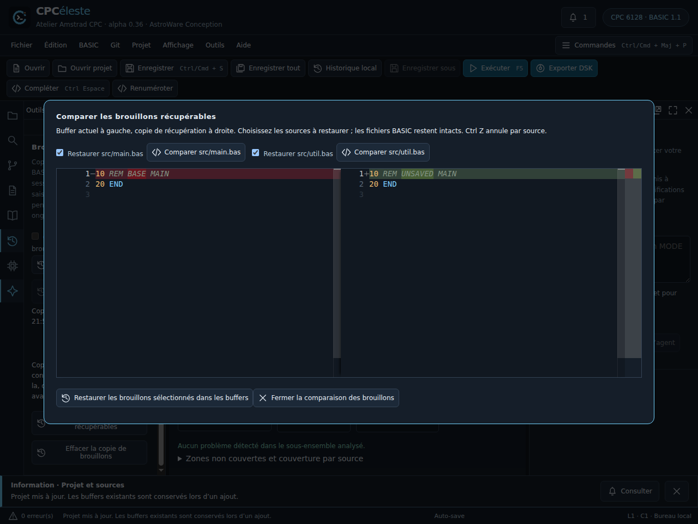

### Réagir à une modification externe

Si un autre éditeur, un outil ou une commande modifie une source, CPCéleste détecte la modification ou la suppression et conserve votre buffer. Examinez le diff, puis choisissez de charger la version externe ou de conserver votre version après comparaison. Le chargement explicite garde une possibilité d’annulation ; aucun rechargement silencieux ne remplace votre saisie.

### Reprendre une opération interrompue

À l’ouverture d’un projet présentant un journal incomplet, un dialogue propose d’annuler l’ouverture, de **terminer** l’opération ou de **rétablir** l’état antérieur. Les conflits non reconnus bloquent la reprise pour préserver les données. Sauvegardes, mutations agent et organisation des sources ont leurs propres parcours couverts. Les preuves d’arrêt de processus ne constituent pas une garantie contre toute panne électrique ou de stockage : conservez aussi vos sauvegardes de projet et votre historique Git.

<a id="agent"></a>
## 12. Un agent qui travaille dans votre projet

L’assistant de CPCéleste sait utiliser des outils de programmation : explorer les fichiers autorisés, consulter les références BASIC, créer ou remplacer des sources, analyser les listings et construire le DSK. **Votre demande peut devenir du code enregistré dans le projet**, avec journal d’activité, comparaison et checkpoint.

### Configurer l’IA

1. Ouvrez un projet.
2. Dans l’assistant, ouvrez **Réglages IA**.
3. Dans **Connexion OpenAI**, saisissez votre clé puis cliquez sur **Configurer la clé**.
4. Dans **Modèle et estimation**, choisissez un modèle accessible et compatible avec les outils requis. Dépliez **Tarifs et estimation (USD)** pour consulter les informations disponibles, puis ajustez les trois limites dans **Budget par lancement ou reprise**.
5. Fermez les réglages et formulez votre mission dans le panneau principal.

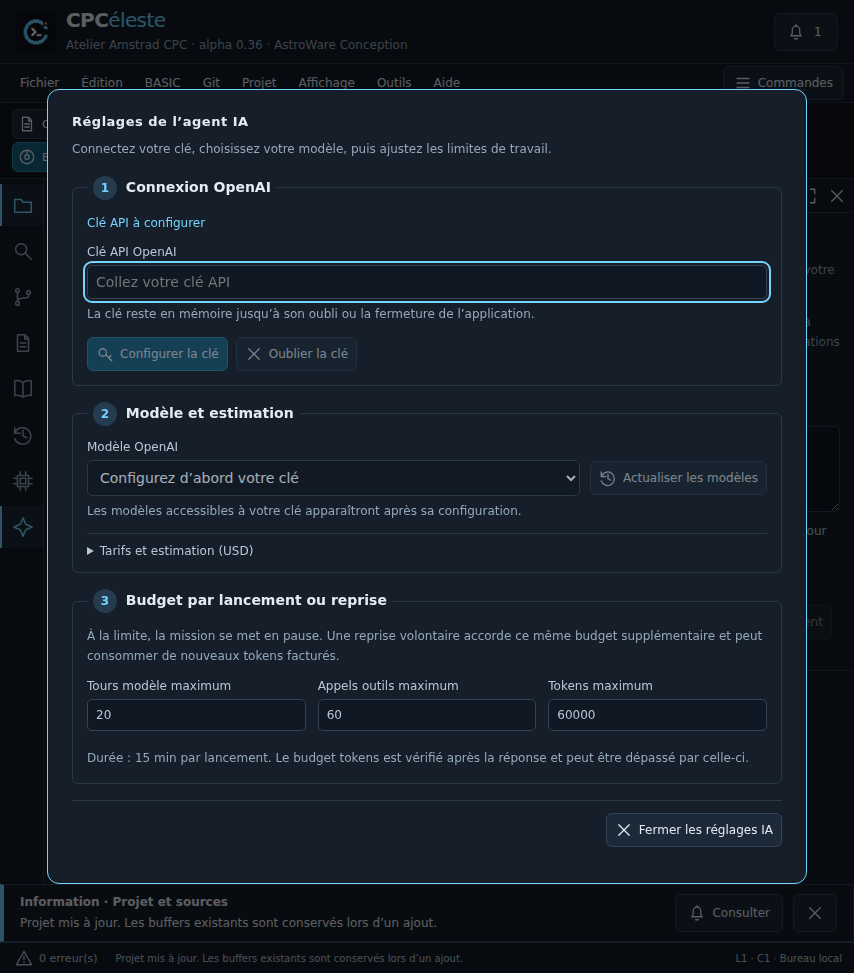

Les libellés restent au-dessus de leur champ, y compris dans une fenêtre étroite. Les réglages s’appliquent au fil de vos actions ; le bouton de fermeture vous ramène à la mission.

Le catalogue présente les modèles accessibles à votre clé et peut être actualisé ; son rafraîchissement automatique est prévu toutes les 15 minutes. L’accès au modèle ne garantit pas à lui seul sa prise en charge des outils : celle-ci est vérifiée lors de la mission. Les modèles avec une date de retrait connue sont signalés.

La clé est retirée du champ après configuration et conservée en mémoire côté application jusqu’à son oubli ou sa fermeture. L’accès API et sa facturation sont distincts d’un abonnement ChatGPT. Le fournisseur livré est OpenAI ; l’architecture extensible ne signifie pas que plusieurs fournisseurs sont déjà proposés.

### Formuler une mission utile

Décrivez le résultat, le mode vidéo, les contraintes, les fichiers concernés et la manière de vérifier le travail. Par exemple :

> Crée un écran de titre pour un jeu de mahjong en MODE 1. Je veux un titre lisible, un cadre décoratif et des motifs de tuiles construits en BASIC. Consulte les références des commandes graphiques utilisées. Travaille dans la source d’entrée, conserve le reste du projet, puis construis le DSK et explique les choix à vérifier dans l’émulateur.

L’agent dispose des buffers autorisés au lancement. Les documents du projet demandent une autorisation distincte. Pendant la mission, l’édition manuelle et certaines opérations concurrentes sont verrouillées pour éviter les changements simultanés.

### Ce que l’agent peut faire aujourd’hui

| Capacité | Travail effectué |
| --- | --- |
| Explorer | Lister les sources, lire des plages et rechercher dans le projet |
| Se documenter | Rechercher et lire les références Locomotive BASIC, y compris en lots |
| Utiliser votre contexte | Lister et consulter les documents autorisés ; demander un aperçu d’image avec un modèle compatible |
| Produire | Créer une source ou remplacer une source avec contrôle de version |
| Transformer | Renuméroter avec le même outil conservateur que l’éditeur |
| Vérifier statiquement | Obtenir les diagnostics disponibles |
| Construire | Produire et relire structurellement le DSK du projet |
| Rendre son travail examinable | Afficher messages publics, résultats d’outils, changements et état de construction |

Les écritures réussies de l’agent sont **enregistrées automatiquement**. L’agent consulte les fiches des commandes couvertes avant de les introduire dans une mutation. Il ne reçoit ni terminal hôte, ni accès Git, ni ROM ; il ne dispose pas encore d’un outil de RUN ou de capture du CPC. Vous lancez donc F5 pour juger le résultat graphique ou comportemental.

### Suivre une mission sans deviner ce qui se passe

Le panneau affiche l’état, les tours, les appels d’outils, les tokens et les fichiers effectivement modifiés. **Journal technique** expose les résultats et erreurs des outils ; **Changements** compare l’avant et l’après. Une consigne de suivi peut préciser la suite du travail.

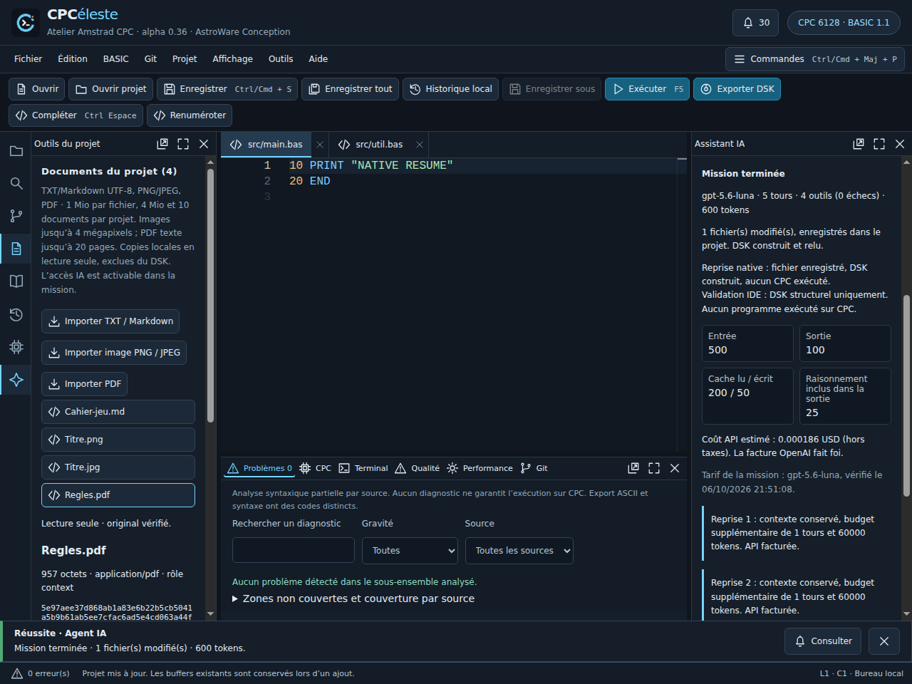

*Les réponses OpenAI et tarifs de cette capture proviennent d’un scénario de validation contrôlé. Elle illustre l’interface et les outils réels, sans représenter une facture ou une performance d’un modèle commercial.*

### Comprendre une pause de budget

Le défaut actuel est **20 tours, 60 outils et 60 000 tokens**, avec **15 minutes par lancement ou reprise**. Dans les réglages, vous pouvez adapter les limites entre 1 et 100 tours, 1 et 200 appels d’outils, et 1 000 à 500 000 tokens. Le budget de tokens est contrôlé après une réponse et peut être dépassé par celle-ci. Les missions restent bornées à 64 Kio par source et 256 Kio pour leur ensemble de sources ; les limites d’édition humaine sont distinctes.

Une pause liée aux tours, outils ou tokens peut proposer **Reprendre la mission** : l’agent conserve le contexte et le checkpoint initial dans la session, avec un budget supplémentaire annoncé. Une reprise peut donc entraîner de nouveaux coûts API.

Jusqu’à dix continuations sont prévues dans la même session. Un changement humain ou externe du projet peut bloquer la reprise. Changer ou oublier la clé invalide également cette continuité. Si le contexte sature ou que la mission stagne, reformulez une tâche plus ciblée. La conversation n’est pas restaurée après fermeture de l’application.

### Lire la consommation et revenir en arrière

Quand usage et tarif sont suffisamment établis, CPCéleste affiche une **estimation API en USD**, avec le détail de consommation disponible. Les tarifs sont lus depuis les fiches officielles prises en charge et peuvent être actualisés. Si les données sont incomplètes, périmées ou incompatibles, le coût est annoncé indisponible. Les budgets de tokens ne constituent pas un plafond monétaire exact.

**Arrêter l’agent** interrompt le travail à venir et la requête en cours ; cela ne défait pas les modifications déjà enregistrées. Pour revenir à l’état de départ, utilisez **Restaurer le checkpoint initial** après examen. La restauration contrôle les révisions, remet les sources et le manifeste initiaux et retire les créations de la mission lorsque les préconditions sont satisfaites. Un changement concurrent bloque cette opération plutôt que de l’écraser.

<a id="documents"></a>
## 13. Donner à votre projet ses références et ses intentions

Un programme se nourrit aussi de textes, de règles de jeu, de croquis et de documents. **Documents du projet** garde ce contexte à proximité du code. L’import copie l’original et le vérifie ; les aperçus sont consultables dans l’atelier. Les documents ne sont pas des sources BASIC et restent exclus du DSK.

| Format | Ce que vous pouvez faire | Limites utiles |
| --- | --- | --- |
| TXT / Markdown UTF-8 | Importer, lire le texte, autoriser la lecture et la recherche d’extraits par l’agent | Aperçu texte, sans exécution de contenu |
| PNG / JPEG | Voir l’aperçu nettoyé, autoriser une demande d’analyse visuelle | Modèle vision compatible requis ; pas de conversion SCR intégrée |
| PDF contenant du texte | Consulter les pages de texte extraites et donner accès à des extraits | Extraction locale, sans rendu visuel ni OCR ; PDF chiffrés refusés |

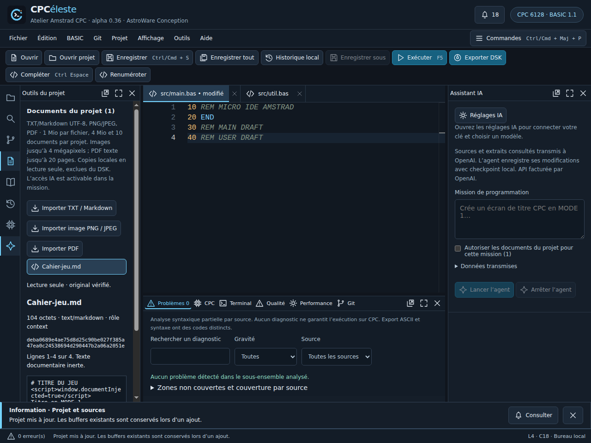

Dans le panneau, utilisez **Importer TXT / Markdown**, **Importer image PNG / JPEG** ou **Importer PDF**, puis sélectionnez le document pour le consulter. Les textes se consultent par plages de 200 lignes, avec **Lignes précédentes / suivantes**. Pour le PDF, naviguez aussi entre les pages extraites ; les colonnes et tableaux peuvent perdre leur ordre visuel pendant l’extraction. Les aperçus d’image indiquent les dimensions, retirent les métadonnées et ignorent l’orientation EXIF. Un document sans texte extractible est signalé.

Les quotas communs sont **1 Mio par original, 4 Mio et 10 documents par projet**. Les images sont limitées à **4 mégapixels**. Le PDF est borné à **20 pages**, **64 Kio de texte par page**, **256 Kio de texte au total**, avec un temps d’extraction limité à 15 secondes.

Cochez **Autoriser les documents du projet pour cette mission** si vous souhaitez que l’agent s’en serve. Les extraits et aperçus sont demandés progressivement par les outils ; les pixels d’une image ne sont pas envoyés automatiquement au lancement. Une image importée constitue une référence pour le modèle, pas un écran CPC déjà converti. WebP, OCR et conversion graphique dédiée restent à venir.

<a id="qualite"></a>
## 14. Prendre du recul sur la qualité de votre BASIC

Le BASIC autorise une grande liberté ; elle mérite un regard attentif lorsqu’un programme grandit. **Rapport de qualité BASIC** propose une lecture mesurée de vos listings, sans réseau, sans clé et sans calcul supplémentaire permanent pendant la frappe.

1. Ouvrez **BASIC → Rapport de qualité BASIC…**, la palette ou l’onglet **Qualité**.
2. Choisissez **Source active** ou **Sources chargées**.
3. Cliquez sur **Générer le rapport**.
4. Examinez les métriques, filtrez les remarques et rejoignez leurs positions dans le code.
5. Exportez en **Markdown** pour une lecture partagée ou en **JSON** pour une exploitation outillée.

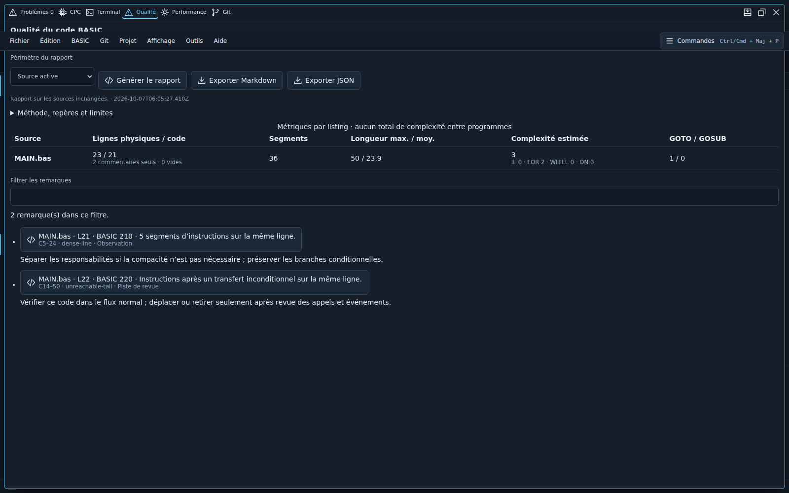

### Mesurer avant de juger

Le rapport présente, pour chaque listing, lignes physiques et lignes de code, commentaires, lignes vides, segments séparés par des deux-points, longueurs maximale et moyenne, `GOTO/GOSUB` et **complexité cyclomatique estimée**. Les longueurs portent sur le texte source, pas sur la mémoire tokenisée du CPC.

L’estimation de complexité suit la formule `1 + IF + FOR + WHILE + nombre de cibles des ON sélecteurs`, pour un listing contenant du code. C’est un indicateur lexical, pas un graphe de contrôle exact : événements, erreurs, routines et sauts calculés ne sont pas entièrement reconstruits. Les contributions non reconnues sont signalées et les complexités des programmes indépendants ne sont pas additionnées.

### Explorer les chemins du programme

Dépliez **Flux BASIC** pour découvrir les branchements du listing. Filtrez les nœuds par numéro BASIC ou instruction, sélectionnez celui qui vous intéresse et suivez ses prédécesseurs et successeurs. Un clic, Entrée ou Espace sur un nœud recentre le graphe ; **Voir cette instruction dans le code** rejoint sa position. Les points d’entrée, appels GOSUB, cycles et récursions possibles complètent le rapport.

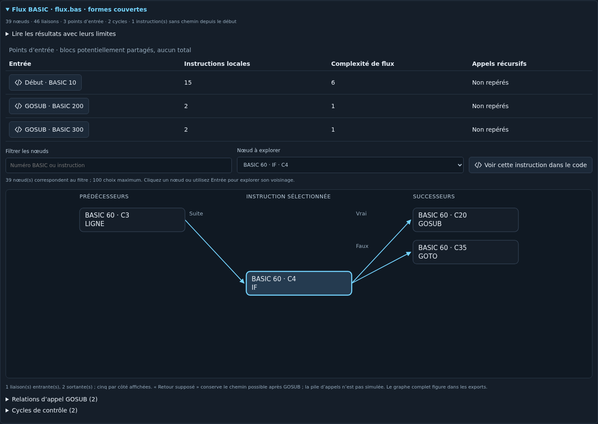

La **complexité de flux** porte sur les décisions accessibles depuis chaque entrée, sans développer ses sous-routines. Elle complète le comptage lexical ci-dessus ; les blocs partagés interdisent d’additionner les routines. L’[exemple fourni](../examples/control-flow/README.md) permet d’essayer immédiatement le parcours.

Une instruction sans chemin depuis le début est une piste de revue : CONT ou RUN avec un autre numéro peuvent lui donner un rôle. Les formes inconnues, notamment contrôle machine, événements, IF imbriqués et NEXT multiples, rendent le graphe partiel et suspendent complexité et conclusions d’inaccessibilité. Les conditions ne sont pas évaluées ; les cycles ne prouvent pas que le programme boucle indéfiniment. [Détail des formes et limites](implementation/basic-control-flow-alpha.md).

### Six familles de remarques

| Remarque | Repère actuel | Comment l’utiliser |
| --- | --- | --- |
| Ligne longue | Plus de 120 caractères | Examiner si sa lecture peut être facilitée |
| Ligne dense | Plus de 4 segments | Distinguer compacité utile et surcharge |
| Densité conditionnelle | Plus de 2 IF sur une ligne | Relire soigneusement les conditions et ELSE |
| Bloc répété | Deux lignes consécutives répétées, au moins 12 tokens combinés | Envisager une factorisation, en respectant le fonctionnement BASIC |
| Suite potentiellement inaccessible | Segment après certains GOTO littéraux ou RETURN nus | Revoir le flux normal de cette ligne |
| Instruction sans chemin depuis le début | Graphe structurel couvert, sans chemin depuis la première ligne | Examiner les points d’entrée et usages manuels avant toute suppression |

Les numéros, espaces, casse et commentaires sont normalisés pour rechercher les duplications ; les chaînes sont préservées et DATA est exclu. Les remarques n’interdisent pas les variables courtes, `GOTO`, `POKE` ou `CALL`, qui appartiennent aux usages CPC. **Aucune suggestion ne modifie votre code automatiquement.**

Si vous éditez, renommez ou supprimez une source, le rapport devient obsolète et demande un nouveau calcul avant navigation. Vous pouvez annuler une analyse. Les exports contiennent la date, les métriques, les remarques et la couverture, sans inclure les listings ou leurs extraits. Les limites et omissions sont indiquées ; une absence de remarque ne certifie pas la qualité du programme.

### Vérifier le comportement avec les tests BASIC (0.39.1)

La lisibilité ne suffit pas : **vos routines doivent aussi produire les bons résultats**. Ouvrez [l’exemple de tests de score](../examples/basic-tests/tests-score.bas), puis **BASIC → Tests BASIC à la demande…** ou l’onglet **Tests BASIC**. Choisissez le listing actif ou les listings déclarés parmi les sources chargées, puis lancez les tests explicitement.

Chaque programme de test s’exécute par les ROM sur un CPC et un DSK isolés. Vos buffers, brouillons et session interactive restent intacts. Les assertions sont écrites en BASIC, déclarées par des lignes `REM @CPCTEST` et transmettent leurs résultats via une petite zone RAM réservée avec `MEMORY &7FFF`. L’exemple montre deux scénarios et une routine GOSUB ; aucune syntaxe ASSERT nouvelle ni extraction automatique de routine.

Le rapport distingue **réussi, échoué, incomplet, délai dépassé, bloqué et annulé**. Il conserve les hashes de la source réellement testée, du DSK et des ROM, ainsi que le temps émulé. Modifier le code rend le rapport obsolète sans lancer un nouveau test. Exportez Markdown ou JSON sans inclure vos sources ou les ROM.

Le premier banc accepte le jeu 6128 anglais identifié, jusqu’à 8 listings autonomes de 16 Kio et 32 assertions chacun. Le budget après RUN est réglable de 1 à 15 secondes émulées ; un délai ou une fin sans résultats complets ne vaut jamais réussite. Les scénarios de la 0.39.1 ajoutent clavier programmé et observations exactes écran/fichier ; la couverture reste à venir. [Convention, exemple et limites détaillées](implementation/basic-tests-alpha.md).

### Retrouver ses suites et tester des interactions

**Enregistrez vos vérifications comme une véritable suite de projet.** Dans **Suites du projet**, donnez un nom à une sélection de listings et mémorisez son budget. Vous pouvez ensuite exécuter tous ses tests ou un seul, puis retrouver les dix derniers rapports après réouverture. Le bouton **Voir ligne…** rejoint la déclaration de l’assertion ; il se désactive si le rapport ne correspond plus aux sources courantes.

Le [projet d’exemple](../examples/basic-test-suite/README.md) contient une suite de règles de jeu et une suite **Clavier, fichier et écran**. Cette dernière charge un petit fichier initial, reçoit une saisie programmée et contrôle le résultat écrit sur son disque ainsi qu’une zone de l’écran. Les entrées et fichiers sont confinés au CPC de test. Une observation incorrecte fait échouer le rapport global, même lorsque les assertions BASIC ont réussi.

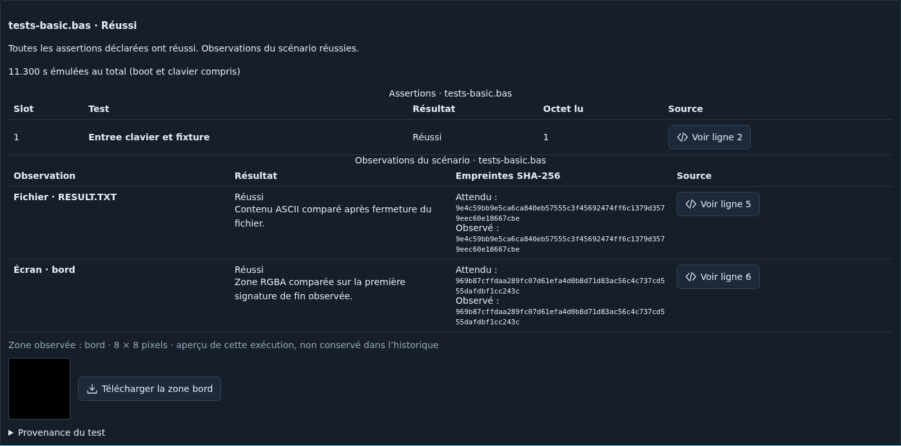

L’image de la zone observée peut être téléchargée en PNG pour examen. Les comparaisons visuelles sont exactes et dépendent du moteur/firmware qualifié : ce n’est ni de la reconnaissance de texte ni une appréciation IA. Les captures ne sont pas conservées dans l’historique ; les verdicts et empreintes le sont. [Guide des suites](implementation/basic-test-suites-alpha.md) · [Écrire un scénario](implementation/basic-scenarios-alpha.md).

### Observer la réactivité de l’IDE

**Affichage → Afficher les mesures de performance**, ou l’onglet **Performance**, expose durées d’analyse par source, réutilisation du cache, révisions et compteurs de demandes acceptées ou périmées. **Recommencer** remet cette observation à zéro sans relancer le parser.

Le suivi de réactivité fonctionne seulement lorsque le panneau et la fenêtre sont visibles ; les données restent locales en mémoire. Il ne mesure pas l’intégralité du CPU ou de la mémoire Electron. L’analyse de qualité est séparée des diagnostics pendant la saisie : vous gardez la maîtrise du moment où vous demandez ce travail supplémentaire.

<a id="git"></a>
## 15. Construire un historique choisi avec Git

L’historique local accompagne les sauvegardes ; Git vous permet de choisir les étapes significatives de votre projet, de les nommer et de les partager. Installez Git séparément, puis ouvrez son panneau avec **Git** ou `Ctrl/Cmd + Maj + G`.

### Créer ou examiner un dépôt

**Préparer la création Git** permet d’initialiser un dépôt local sur `main`, après aperçu et confirmation. Un `.gitignore` existant est conservé ; les exclusions privées sont installées selon l’état du projet. Aucun premier commit n’est créé automatiquement.

**Actualiser Git** affiche branche, version et statut. Sélectionnez un fichier pour examiner ses différences entre disque et index. Les mutations sont conservatrices : sources déclarées, manifeste et `.gitignore` constituent le périmètre initial pris en charge, tandis que les documents privés restent exclus. Un brouillon doit être arbitré avant les mutations concernées.

### Préparer un commit dont vous connaissez le contenu

1. Enregistrez les sources à versionner.
2. Actualisez le statut et examinez le diff.
3. Ajoutez à l’index chaque fichier voulu, ou retirez-le si nécessaire.
4. Renseignez explicitement le nom et l’email d’auteur.
5. Écrivez votre message de commit.
6. Examinez l’aperçu de l’index exact, puis confirmez le commit dans le dialogue natif.

Les commits locaux sont non signés ; les hooks ne sont pas exécutés par ce parcours. Un **profil privé d’identité Git**, facultatif, permet de mémoriser, charger et oublier le nom et l’email pour les prochains projets et redémarrages. Ce profil ne constitue pas une connexion GitHub.

**Historique Git** présente les commits par pages de 20, avec identifiant, date et sujet. Relisez le journal pour prendre en compte de nouveaux commits. Le diff disque/index reste dans le panneau Git ; la liste de commits ne propose pas encore l’inspection générale du contenu de chaque version. Cet historique est distinct de celui des sauvegardes locales.

### Faire proposer le message par l’IA

**Proposer le message par IA** utilise le modèle et la clé OpenAI de l’assistant. Une confirmation précise les fichiers indexés et la transmission facturable. Le diff exact de l’index est envoyé, dans la limite de 128 Kio ; la proposition reste éditable et ne crée ni commit ni push. Vous choisissez le texte final, puis suivez le parcours ordinaire de confirmation.

<a id="github"></a>
## 16. Branches, synchronisation et GitHub dans l’atelier

### Travailler avec des branches et des remotes

Dans **Branches et synchronisation**, chargez les références puis gérez vos branches et destinations distantes. Vous pouvez ajouter, modifier ou retirer un remote HTTPS ou SSH, créer une branche, basculer sur une branche locale ou distante et supprimer une branche locale déjà fusionnée. Créer une branche ne bascule pas automatiquement dessus.

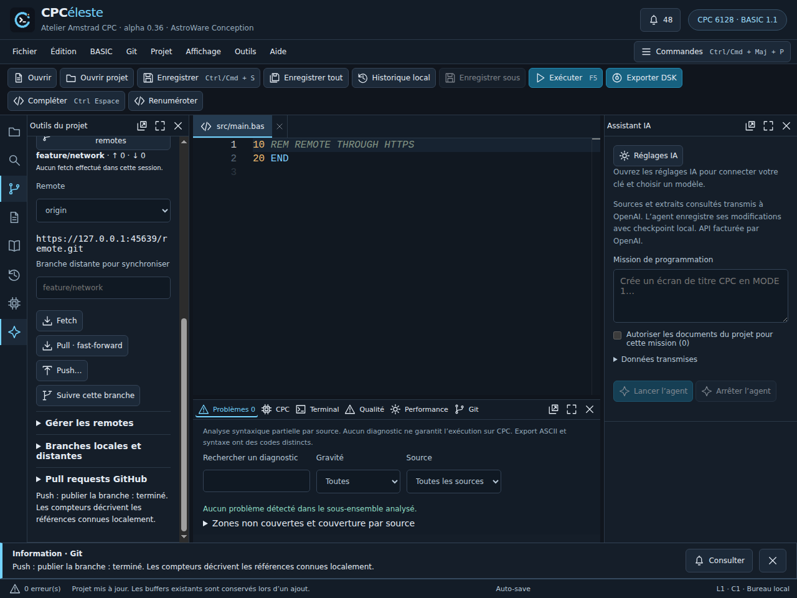

| Action | Effet |
| --- | --- |
| **Fetch** | Actualiser les références distantes sans remplacer les sources |
| **Pull fast-forward** | Préparer puis appliquer une avance simple après fetch |
| **Push** | Préparer et publier les commits nouveaux vers la destination examinée |
| Basculer de branche | Vérifier la cible puis recharger le projet et ses sources |
| Arrêter l’opération | Demander l’arrêt du processus Git possédé par l’application |

Les brouillons, changements locaux incompatibles et collisions bloquent les opérations qui les mettraient en danger. Un pull divergent est refusé : l’IDE ne lance pas de merge, rebase ou stash automatique. Il n’effectue pas de force-push. Les projets cibles sont vérifiés avant ouverture ou changement de branche.

Le push examine les arbres des nouveaux commits pour détecter notamment ROM, disquettes, fichiers privés, binaires et motifs de secrets. **Les projets dont le manifeste référence des documents sont actuellement refusés à la publication par ce parcours** : un projet partagé ne doit pas promettre des pièces privées absentes. Ce contrôle a des bornes et ne remplace pas votre revue des fichiers et de l’historique.

### Connecter votre compte GitHub

Ouvrez **Git → Compte GitHub et dépôts privés**. Vous pouvez saisir un jeton personnel ou importer le compte déjà connecté dans GitHub CLI. Le jeton est retiré du champ et conservé en mémoire pour la session. Se déconnecter de CPCéleste ne déconnecte pas GitHub CLI.

Depuis ce dialogue, vous pouvez :

- lister et filtrer les dépôts accessibles, publics ou privés ;
- associer un dépôt au projet courant ;
- cloner un projet CPCéleste dans un nouveau dossier ;
- créer un dépôt dans votre compte personnel, **privé par défaut**, puis l’associer ;
- lister les premières PR ouvertes ;
- préparer une PR de la branche courante vers une base choisie, **en brouillon par défaut** ;
- ouvrir la PR ou la CI dans le navigateur.

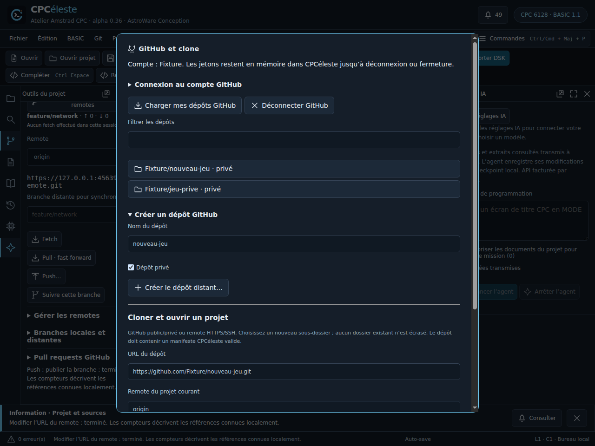

*Les comptes et réponses GitHub de cette capture sont des données de recette simulées ; aucun compte personnel n’est exposé.*

Publiez votre branche avant de créer la PR. Création de dépôt et de PR sont confirmées ; l’IDE ne fusionne pas automatiquement une PR. Les permissions nécessaires sont indiquées dans le parcours et restent soumises aux règles du compte ou de l’organisation. SSH utilise les clés système déjà configurées ; le jeton GitHub n’authentifie pas une connexion SSH.

Un arrêt réseau n’est pas un retour arrière transactionnel : après une interruption, vérifiez la situation locale et distante avant de recommencer. Les fonctions Git avancées — résolution de conflits, rebase, stash, tags, signatures, cherry-pick et blame — restent à compléter.

<a id="terminal"></a>
## 17. Un terminal pour vos commandes ponctuelles

Le panneau **Terminal**, accessible par **Affichage → Afficher le terminal** et le raccourci configuré, exécute des commandes hôte dans le dossier du projet après confirmation. Il affiche sortie standard, erreurs et code de retour, avec commande d’arrêt, limite de 30 secondes et 64 Kio de sortie. Une commande tient sur une ligne de 4 Kio au maximum ; l’entrée standard est fermée et les profils shell ne sont pas chargés.

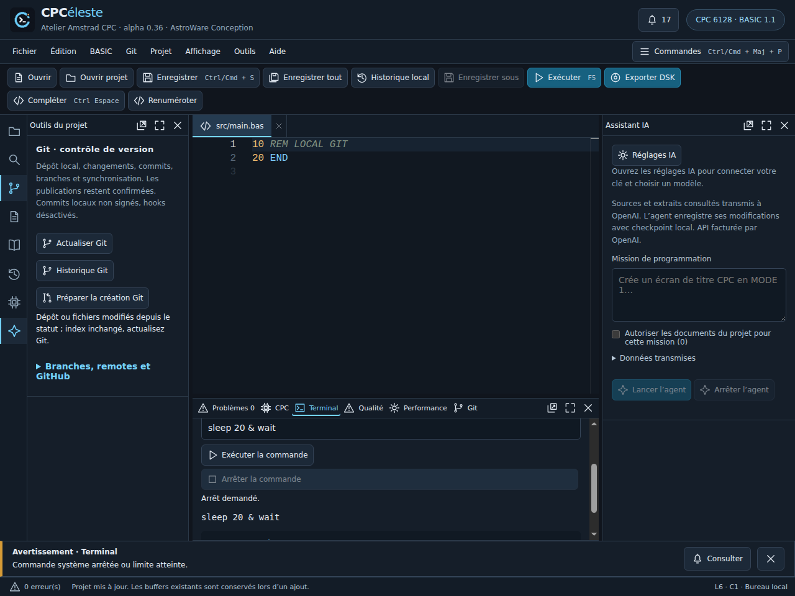

Utilisez-le pour une commande ponctuelle adaptée à votre système. Il s’agit d’un **terminal à commandes sans PTY interactif** : il ne remplace pas une session interactive complète. Une seule commande est active à la fois ; pendant son exécution, l’édition et les opérations concurrentes concernées sont bloquées. Arrêter attend la fin effective avant de les libérer.

Le terminal est un outil humain : il peut agir sur votre machine avec vos droits, tandis que l’agent IA n’y a pas accès. Une commande qui modifie les sources sur disque ne remplace pas automatiquement les buffers ; passez par la revue des modifications externes. L’historique Git et les sorties d’exécution restent accessibles dans les autres onglets du dock.

<a id="personnalisation"></a>
## 18. Faire de CPCéleste votre atelier

**Outils → Paramètres**, ou `Ctrl/Cmd + ,`, ouvre un centre de réglages avec recherche et catégories. Les modifications sont préparées dans le dialogue : **Appliquer les paramètres** les active, **Annuler** les abandonne.

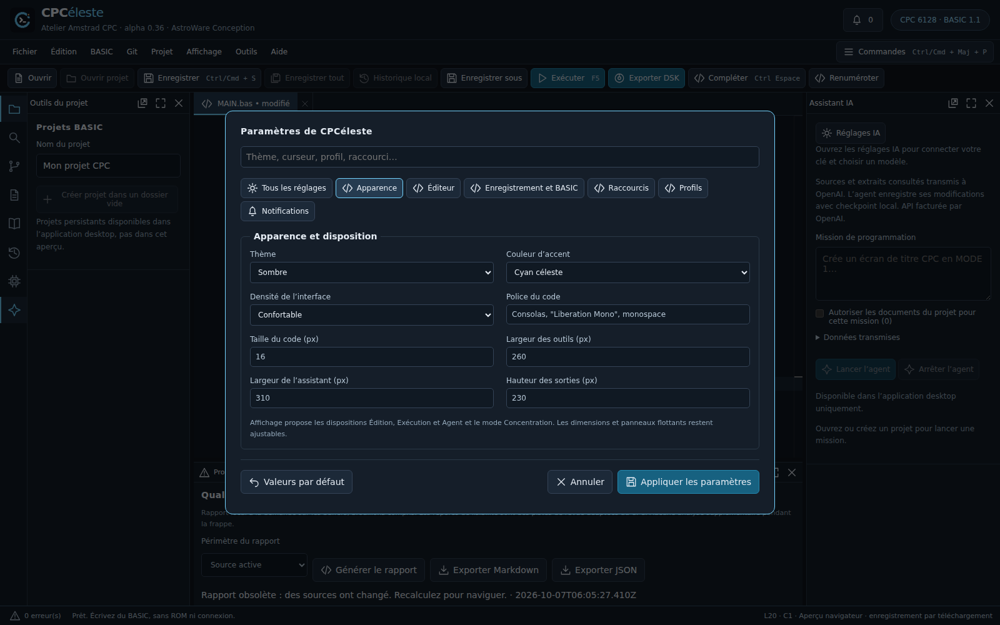

### L’ambiance et le confort de lecture

Choisissez un thème **sombre, clair ou système**, puis l’un des cinq accents : **cyan, ambre, violet, vert ou rose**. La densité confortable ou compacte ajuste l’atelier. Police du code, taille de **10 à 32 px** et dimensions des panneaux complètent votre espace.

Les réglages de l’éditeur comprennent indentation, espaces, fermeture des parenthèses, retour visuel, minimap, interligne, numéros physiques absolus/relatifs/masqués, caractères invisibles, curseur trait/bloc/souligné, clignotement, ligatures, guides, coloration des paires de parenthèses et règle de colonne. Les polices et ligatures dépendent de ce qui est installé sur votre système.

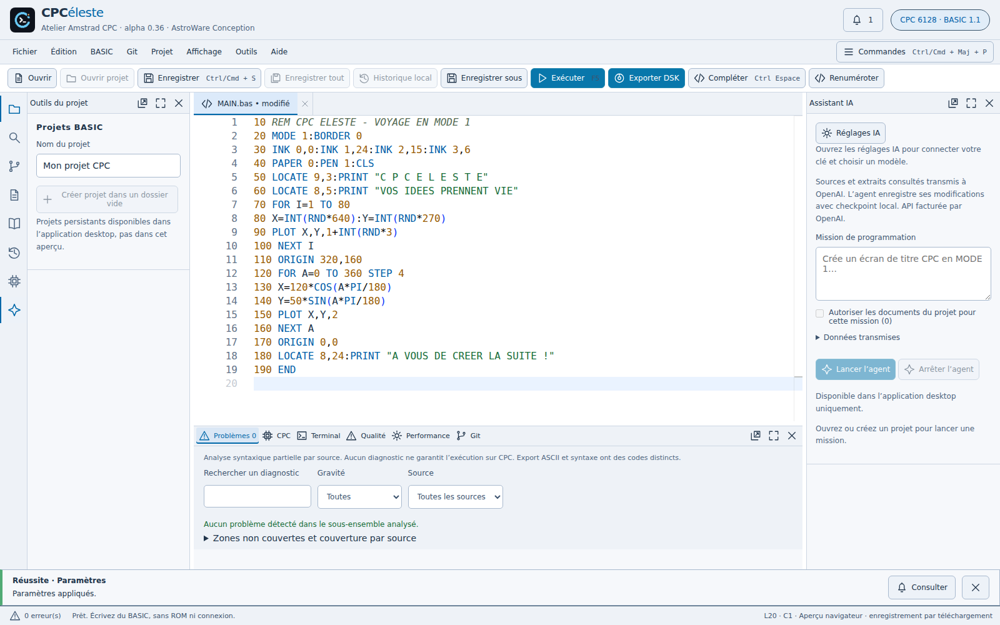

L’accent colore l’atelier, pas la palette du CPC. Le retour visuel et les numéros physiques changent la lecture du code, pas le listing. Le zoom du code par menu ou `Ctrl/Cmd + molette` suit la même taille persistante.

### Vos raccourcis, vos habitudes

Dans **Raccourcis**, choisissez la base CPCéleste inspirée de VS Code, ou la base inspirée de JetBrains. Cliquez ensuite dans le champ d’une commande et pressez la combinaison voulue. Retour arrière ou Suppr retire une affectation. Les collisions et les gestes réservés à l’édition ou au système sont signalés avant application.

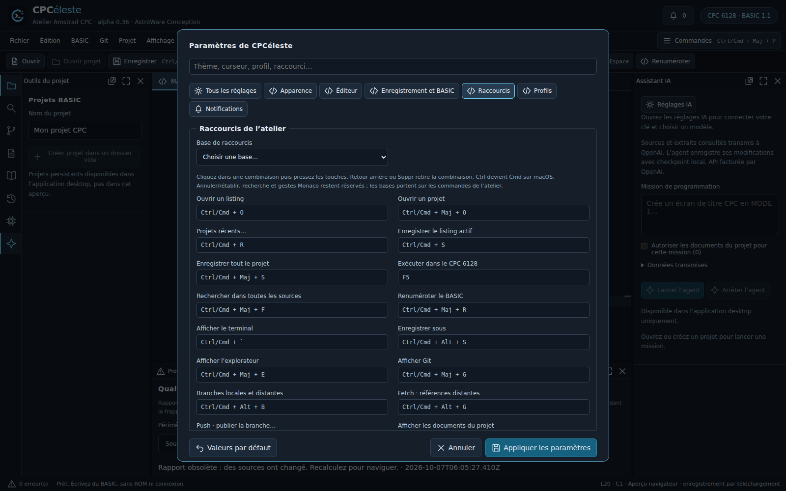

La personnalisation porte sur les commandes de l’atelier, pas sur toutes les interactions Monaco. Les séquences de plusieurs frappes, le double Maj et les raccourcis souris personnalisés ne sont pas proposés. Menus, palette, boutons concernés et aide affichent vos combinaisons courantes.

### Enregistrer et emporter vos profils

Vous pouvez conserver jusqu’à **12 profils locaux nommés**, les charger, les mettre à jour ou les supprimer. L’export produit un JSON de personnalisation ; l’import prépare les valeurs, puis **Appliquer** les active. Un profil inclut apparence, édition, auto-save, dimensions et raccourcis : vérifiez notamment l’auto-save avant d’appliquer un profil reçu.

Les exports n’incluent pas de clé IA ou GitHub, d’identité Git, de chemins de projets, de sources, de ROM ou de conversation. La géométrie des panneaux flottants n’y est pas incluse. Les profils sont portables par fichier ; aucune synchronisation automatique entre appareils n’est proposée.

<a id="notifications"></a>
## 19. Retrouver les messages au bon moment

La **cloche** indique les messages non lus. **Affichage → Centre de notifications**, la palette ou `Ctrl/Cmd + Alt + N` ouvrent l’historique de session. Vous disposez de recherche, filtres par niveau et origine, messages non lus, marquage individuel ou global, retrait et effacement.

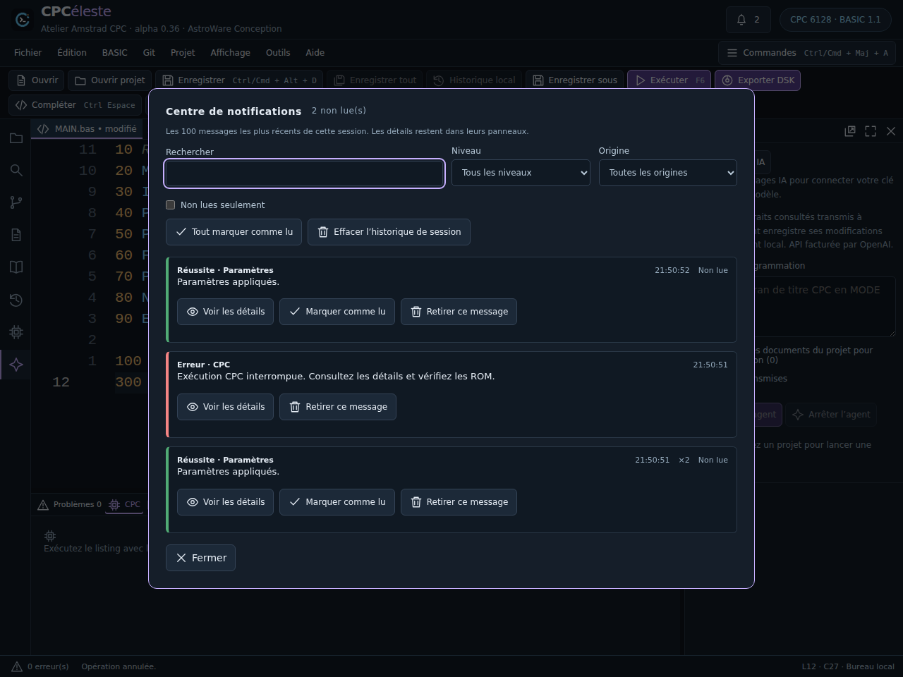

Les **100 messages les plus récents** conservent heure, origine, niveau et répétitions rapprochées. **Voir les détails** rejoint le panneau approprié lorsque la session concernée est encore valide. Les actions de reprise, arrêt et restauration restent dans leurs outils respectifs.

Dans **Paramètres → Notifications**, choisissez tous les aperçus, seulement les erreurs ou aucun aperçu. Le centre et son compteur restent consultables. L’historique des notifications n’est pas conservé après redémarrage et ne remplace pas les journaux durables des opérations sur les sources.

<a id="confidentialite"></a>
## 20. Comprendre où travaillent vos données

La philosophie du produit est celle d’un atelier local avec des connexions explicites. Vous pouvez continuer à écrire, analyser et construire lorsque vous ne souhaitez pas utiliser de service IA.

| Données ou opération | Comportement actuel |
| --- | --- |
| Sources et manifeste | Fichiers du projet, lisibles et versionnables |
| Édition, diagnostics, qualité, construction DSK | Traitements locaux ; pas de clé IA requise |
| ROM | Stockage local applicatif séparé ; pas de transmission à l’agent |
| Documents importés | Copies locales et aperçus ; accès agent seulement si autorisé pour la mission |
| Clé OpenAI | Mémoire de l’application pendant la session, hors projet |
| Mission IA | Envoi progressif à OpenAI des sources et éléments autorisés utiles aux outils |
| Proposition de message Git | Envoi confirmé du diff indexé au modèle choisi |
| GitHub et synchronisation Git | Échanges avec la destination explicitement configurée |
| Token GitHub | Mémoire de session ; aucune transmission à l’agent |
| Préférences et profils | Stockage local ; export de personnalisation par liste blanche |
| Notifications et mesures de performance | Mémoire locale, sans export ou transmission intégrée de ces registres |

Les appels IA peuvent être facturés. Les règles de conservation du fournisseur restent applicables ; la conservation locale de votre projet ne signifie pas que les extraits envoyés ne quittent jamais la machine. Les journaux et sauvegardes de travail locaux peuvent contenir vos sources : gardez le contrôle des dossiers que vous copiez ou partagez.

<a id="raccourcis"></a>
## 21. Les raccourcis qui font gagner du temps

Valeurs de la base **CPCéleste**. `Ctrl/Cmd` signifie Ctrl sous Windows/Linux et Cmd dans la convention macOS ; la qualification complète macOS reste distincte. Vos réglages et les raccourcis indiqués dans l’application priment sur ce tableau.

| Action | Raccourci par défaut |
| --- | --- |
| Ouvrir un listing | `Ctrl/Cmd + O` |
| Ouvrir un projet | `Ctrl/Cmd + Maj + O` |
| Projets récents | `Ctrl/Cmd + R` |
| Enregistrer | `Ctrl/Cmd + S` |
| Enregistrer tout | `Ctrl/Cmd + Maj + S` |
| Enregistrer sous, hors projet | `Ctrl/Cmd + Alt + S` |
| Exécuter dans le CPC | `F5` |
| Référence BASIC | `F1` |
| Suggestions du code | `Ctrl + Espace` |
| Rejoindre une cible BASIC connue | `F12` |
| Diagnostic suivant / précédent | `F8` / `Maj + F8` |
| Palette de commandes | `Ctrl/Cmd + Maj + P` |
| Ouverture rapide des sources | `Ctrl/Cmd + P` |
| Rechercher dans toutes les sources | `Ctrl/Cmd + Maj + F` |
| Explorateur | `Ctrl/Cmd + Maj + E` |
| Documents du projet | `Ctrl/Cmd + Maj + D` |
| Assistant IA | `Ctrl/Cmd + Maj + A` |
| Renuméroter | `Ctrl/Cmd + Maj + R` |
| ROM | `Ctrl/Cmd + Alt + R` |
| Git | `Ctrl/Cmd + Maj + G` |
| Préparer un push | `Ctrl/Cmd + Alt + K` |
| Préparer un fetch | `Ctrl/Cmd + Alt + G` |
| Charger les branches | `Ctrl/Cmd + Alt + B` |
| Terminal | Ctrl/Cmd + accent grave (backtick) |
| Masquer/afficher les outils | `Ctrl/Cmd + B` |
| Masquer/afficher les sorties | `Ctrl/Cmd + J` |
| Fermer l’onglet | `Ctrl/Cmd + W` |
| Onglet suivant / précédent | `Ctrl/Cmd + Tab` / `Ctrl/Cmd + Maj + Tab` |
| Paramètres | `Ctrl/Cmd + ,` |
| Mode Concentration | `Ctrl/Cmd + Maj + F11` |
| Notifications | `Ctrl/Cmd + Alt + N` |

Avec la base **inspirée de JetBrains**, la palette devient `Ctrl/Cmd + Maj + A`, l’ouverture de source `Ctrl/Cmd + Maj + N`, les paramètres `Ctrl/Cmd + Alt + S` et la concentration `Ctrl/Cmd + Maj + F12`. Certaines affectations en conflit sont retirées ; les commandes restent accessibles par les menus.

<a id="parcours"></a>
## 22. Trois façons de profiter de tout l’atelier

### Créer un écran de titre

Créez un projet, importez votre cahier d’intentions et éventuellement une image de référence. Écrivez le squelette du programme ou confiez une première proposition à l’agent, avec le mode vidéo et les contraintes graphiques. Examinez les changements, lancez F5, observez le résultat et affinez les coordonnées ou couleurs. Enregistrez une étape dans Git lorsque la composition vous convient, puis exportez votre DSK.

### Reprendre un ancien listing

Ouvrez le fichier UTF-8, repérez les diagnostics et utilisez les fiches pour retrouver le vocabulaire. Naviguez vers les cibles avec F12, recherchez un identifiant dans les sources chargées et renumérotez les plages devenues trop serrées. Demandez un rapport de qualité pour identifier les passages denses ou répétés. Vérifiez chaque transformation significative dans le CPC et conservez les étapes dans l’historique ou Git.

### Travailler à plusieurs sur un projet

Conservez un projet de sources publiable, sans documents privés référencés par son manifeste. Configurez le dépôt et la destination, travaillez sur une branche, examinez vos diffs et publiez les commits voulus. Préparez une PR et ouvrez la CI depuis l’atelier. Une divergence nécessitant un merge ou un rebase se traite avec un outil Git adapté, puis le projet peut être rouvert dans CPCéleste.

<a id="depannage"></a>
## 23. Dépanner les situations fréquentes

| Situation | Que faire ? |
| --- | --- |
| F5 demande des ROM | Importer OS 6128, BASIC 1.1 et AMSDOS séparément, puis vérifier leurs rôles et empreintes |
| Le CPC attend au démarrage | Si le jeu n’est pas reconnu, attendre `Ready` à l’écran et confirmer avec le bouton dédié |
| Le programme affiché ne reflète pas le dernier code | Relancer F5 ; l’édition du buffer ne modifie pas la machine déjà chargée |
| Le clavier n’agit pas dans le CPC | Cliquer dans l’écran, vérifier que la machine n’est pas en pause |
| Le CPC est devenu silencieux ou figé après changement de fenêtre | Reprendre la machine ; activer volontairement le son si nécessaire |
| L’export refuse un listing | Lire les diagnostics d’encodage/structure, vérifier l’ASCII, les noms CPC et la capacité du disque |
| Un fichier apparaît dans l’explorateur mais pas sur le DSK | Vérifier qu’il est déclaré comme source du projet ; les documents et fichiers ordinaires ne sont pas inclus automatiquement |
| Une renumérotation est refusée | Lire la forme non couverte ou la collision indiquée ; modifier la plage ou traiter explicitement le cas |
| Les résultats de recherche ou de qualité sont périmés | Rechercher ou générer de nouveau après la modification de source |
| Le code a changé dans un autre outil | Ouvrir la revue des modifications externes, comparer puis choisir la version à conserver |
| L’agent affiche une limite | Examiner le journal et les fichiers modifiés ; reprendre avec le budget annoncé ou cibler une nouvelle mission |
| L’agent n’a modifié aucun fichier | Examiner les erreurs des outils, les références requises et les limites de la mission ; un tour modèle ne prouve pas une écriture |
| Le coût IA est indisponible | Actualiser les tarifs et vérifier les informations d’usage ; ne pas assimiler l’absence d’estimation à un appel gratuit |
| Pull ou changement de branche est bloqué | Arbitrer brouillons et changements locaux ; traiter une divergence Git dans un outil externe si nécessaire |
| Le push refuse le projet | Examiner les fichiers et commits signalés, les documents référencés et les données privées ; ne pas contourner le refus sans revoir ce qui serait partagé |
| Une commande terminal ne prend pas de saisie interactive | Utiliser une commande non interactive ou un terminal système complet |
| Des panneaux semblent perdus | Utiliser Affichage → Restaurer la disposition des panneaux, ou quitter Concentration |
| Les fonctions desktop sont désactivées dans le navigateur | Lancer l’application avec `npm start` après son build |
| Le premier build prend du temps | Laisser se préparer le SDK et le moteur ; vérifier Python, Git, Node et l’accès réseau si une erreur est affichée |

Depuis **Aide → Proposer une amélioration ou signaler un problème**, préparez un ticket avec le contexte, le besoin et le résultat attendu. L’IDE ouvre un formulaire GitHub prérempli à relire ; **vous décidez de son envoi**. Indiquez votre version, votre système, les étapes de reproduction et un exemple minimal partageable.

<a id="limites"></a>
## 24. Le périmètre actuel et les prochaines ambitions

CPCéleste est déjà un atelier riche, utilisable pour écrire, organiser, analyser et expérimenter. Son statut **alpha** garde un sens précis : la qualification complète de la machine et certaines fonctions d’IDE restent en construction.

| Domaine | Disponible dans cette version | Encore à compléter ou qualifier |
| --- | --- | --- |
| BASIC | Édition, aide partielle, diagnostics structurels, recherche, renumérotation conservatrice | Grammaire et aide exhaustives, renommage sémantique, analyse complète des types/flux |
| Projets | Sources multiples, entrée, explorateur, organisation, historique et reprises couvertes | Création de dossiers, import/duplication générale, restauration globale du projet |
| CPC | RUN intégré, pause, clavier couvert, son activable, disque de session, inspection Z80/RAM | Qualification globale audio/timings/clavier, matériels et firmwares supplémentaires, vérification externe complète |
| Débogage BASIC | Travaux techniques et inspection machine | Points d’arrêt, pas-à-pas et variables dans une interface publique |
| IA | Agent OpenAI, outils, documents autorisés, budgets, reprise de session et checkpoint | Exécution/observation CPC par l’agent, reprise de conversation après redémarrage, autres fournisseurs livrés |
| Ressources | TXT/MD, PNG/JPEG, PDF texte | OCR, rendu PDF visuel, WebP, conversion SCR, outils graphiques/sprites dédiés |
| Qualité | Six règles, graphe exploratoire, appels/cycles, complexité par entrée, exports | Formes imbriquées/événementielles, pile contextuelle, analyse exacte et revue IA dédiée |
| Git | Statut/diff, index, commits, historique, branches/remotes, clone/fetch/pull simple/push, GitHub/PR | Merge/rebase, résolution des conflits, stash, tags, signatures et Git avancé |
| Terminal | Commandes hôte bornées, sorties et arrêt | PTY et expérience interactive complète |
| Distribution | Application Electron construite depuis les sources, archives CI | Installateur autonome signé, auto-update et qualification multiplateforme complète |

La référence actuelle est le **CPC 6128 classique avec Locomotive BASIC 1.1 et AMSDOS**. Les succès sur ce profil ne valent pas promesse de compatibilité CPC 664, Plus, PCW ou PC-1512. Depuis 0.37, le banc **Tests BASIC** exécute les assertions de listings autonomes sur le jeu anglais identifié ; il reste distinct des tests internes de l’IDE et ne fournit pas de couverture ou de lecteur de variables.

La [roadmap qualifiée](specifications/17-roadmap-ide-complet.md) décrit les objectifs et leur état. Les éléments futurs y restent clairement distingués des capacités que vous pouvez utiliser aujourd’hui.

<a id="references"></a>
## 25. Aller plus loin dans les guides spécialisés

Cette notice est l’entrée utilisateur de la version actuelle. Les documents d’incrément ci-dessous donnent les règles détaillées et les preuves ; **leurs sections historiques décrivent la version de leur titre**, parfois enrichie depuis. Pour connaître le comportement courant, lisez également les incréments suivants et la présente synthèse.

| Sujet | Guides détaillés |
| --- | --- |
| Éditeur et outils | [Édition](implementation/editor-alpha.md), [atelier](implementation/workbench-alpha.md), [disposition et préférences](implementation/production-workbench-alpha.md) |
| Projets | [Projets BASIC](implementation/projects-alpha.md), [explorateur](implementation/project-explorer-alpha.md), [organisation des sources](implementation/source-operations-alpha.md), [projets récents](implementation/recent-projects-alpha.md) |
| Lire et transformer | [Diagnostics](implementation/basic-diagnostics-alpha.md), [recherche](implementation/search-alpha.md), [renumérotation](implementation/renumber-alpha.md), [corpus BASIC](../knowledge/locomotive-basic/README.md) |
| Sauvegardes | [Enregistrer tout](implementation/save-all-alpha.md), [journal de reprise](implementation/recovery-alpha.md), [historique local](implementation/local-history-alpha.md), [brouillons](implementation/drafts-alpha.md), [modifications externes](implementation/external-alpha.md) |
| CPC | [ROM](implementation/firmware-alpha.md), [exécution](implementation/emulator-run-alpha.md), [inspection](implementation/cpc-inspection-alpha.md), [intégration](implementation/emulator-integration.md), [qualification J0](implementation/j0-report.md), [plan de débogage](implementation/basic-debugger-plan.md) |
| IA | [Agent et outils](implementation/agent-alpha.md), [missions et consommation](implementation/agent-missions-alpha.md), [reprise des mutations](implementation/agent-durability-alpha.md) |
| Documents | [Texte](implementation/documents-alpha.md), [images](implementation/images-alpha.md), [PDF](implementation/pdf-alpha.md) |
| Git local | [Lecture](implementation/git-alpha.md), [index](implementation/git-local-index-alpha.md), [commits](implementation/git-commit-alpha.md), [identité](implementation/git-identity-alpha.md) |
| Réseau et GitHub | [Branches, synchronisation, GitHub et messages IA](implementation/git-network-alpha.md) |
| Votre atelier | [Personnalisation et profils](implementation/personalization-alpha.md), [notifications](implementation/notifications-alpha.md) |
| Qualité | [Mesures, règles, méthodes et bornes](implementation/basic-quality-alpha.md) |
| Produit et contribution | [Identité visuelle](brand/README.md), [dossier de conception](README.md), [roadmap](specifications/17-roadmap-ide-complet.md), [licence MIT](../LICENSE) |

**Créez votre projet, écrivez vos premières lignes, puis appuyez sur F5.** CPCéleste vous accompagne de l’élan initial au programme que vous pourrez continuer, comprendre et partager.

Un logiciel **AstroWare Conception**, porté par **Térence FERUT**. Les contributions propres au projet sont sous licence MIT ; les dépendances et contenus tiers conservent leurs conditions respectives.
