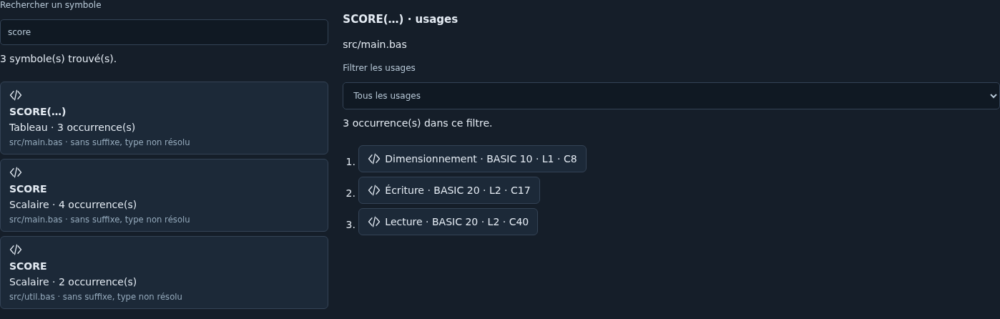

# Symboles et usages BASIC — alpha 0.41.0

Date : 8 octobre 2026. Première tranche de l’intelligence IDE 0.41. [ADR 0059](../adr/0059-symboles-usages-basic.md). IDE-015 reste partiel ; aucun renommage sémantique livré.

## Utilisation

Ouvrir **BASIC → Symboles et usages BASIC…**, la commande correspondante dans la palette ou l’onglet **Symboles** des sorties. Choisir la source active ou toutes les sources chargées, puis **Actualiser l’index**. Les buffers et brouillons sont utilisés sans enregistrement préalable. Aucun calcul n’est lancé par l’ouverture du panneau, la frappe, le changement de sélection ou la recherche dans les résultats.

À gauche, rechercher un nom de variable ou de source. Les scalaires et tableaux sont présentés séparément avec suffixe, nombre d’occurrences et source. À droite, filtrer les lectures, écritures, lectures/écritures, dimensionnements ou suppressions. Chaque occurrence indique numéro BASIC, ligne physique et colonne ; cliquer pour sélectionner le nom exact dans l’éditeur. Un onglet fermé mais encore chargé est rouvert au besoin.

Les résultats sont un snapshot. Modifier une source ou son nom rend l’index obsolète et désactive la navigation ; actualiser pour retrouver les liens. Annuler ou remplacer le projet arrête le worker et retire le résultat en cours. Une panne ou un délai dépassé affiche un message ; la relance reste explicite. Masquer puis rouvrir le panneau conserve le snapshot sans recalcul.

## Sens des résultats

| Forme couverte | Rôle textuel |
| --- | --- |
| `a=b+1`, `LET a=b` | a écrit, b lu |
| `a(i)=b(j)` | a tableau écrit, i lu ; b tableau lu, j lu |
| `DIM a(n)` | a dimensionné, n lu |
| `READ a,b(i)` | a et b écrits, i lu |
| `FOR i=d TO f STEP p` | i écrit ; d, f et p lus |
| `NEXT i,j` | i et j lus/écrits ; NEXT sans nom n’invente aucune occurrence |
| `ERASE a,b` | tableaux a et b supprimés |
| `INPUT "Nom";a`, `LINE INPUT "Nom";a$` | cible écrite ; prompt ignoré |
| IF/WHILE, PRINT/WRITE et commandes de lecture couvertes | identifiants des arguments lus ; valeurs et chaînes non exportées |

La casse est ignorée : Score et SCORE sont regroupés. Les suffixes restent distincts : SCORE, SCORE!, SCORE% et SCORE$ sont des entrées séparées. **Sans suffixe, le type reste non résolu.** A et A! peuvent désigner une même variable au démarrage ; DEFINT peut au contraire rapprocher A et A%. L’index ne fusionne donc pas ces noms. De même, un scalaire et un tableau de même nom restent séparés. Les dimensions/indices ne créent pas d’identités différentes pour chaque élément.

Chaque source est indépendante : le même nom dans deux programmes ne prouve pas une variable partagée. Ces listes ne sont ni une analyse des chemins d’exécution, ni une preuve d’initialisation, ni un décompte d’exécutions, ni une validation de syntaxe. Un nom seulement lu ne déclenche aucun diagnostic d’erreur. Aucune transformation de source n’est proposée dans ce lot.

## Couverture et exclusions

Affectations, tableaux, DIM, READ, FOR/NEXT, ERASE et INPUT ordinaire sont reconnus. Les arguments de PRINT, WRITE, IF, WHILE, ON, AFTER/EVERY, MODE, MEMORY, ERROR, BORDER/INK, LOCATE, MOVE/MOVER, DRAW/DRAWR, PLOT/PLOTR, POKE, OUT, ORIGIN, SOUND, WAIT, KEY, OPENIN/OPENOUT, RANDOMIZE, FILL, WIDTH, ZONE, RELEASE, SYMBOL et SPEED fournissent les lectures textuelles. Cela ne certifie ni leurs signatures complètes ni leurs effets d’exécution.

Les commandes non couvertes sont omises avec raison, notamment les options de SAVE/chargement complexe pour ne pas transformer une lettre d’option en variable. CALL, RSX, adresses `@`, DEF FN et usages FN, MID$ à gauche et INPUT avec flux restent omis. Les identifiants commençant par FN sont conservativement exclus avec leur segment. DEFINT/DEFREAL/DEFSTR produisent une limite visible ; leurs plages alphabétiques ne sont pas indexées. Chaînes, commentaires et DATA sont toujours ignorés, y compris leurs mots-clés ou séparateurs apparents.

Numérotation absente/invalide/non croissante, noms dépassant 40 caractères, parenthèses/chaînes non fermées ou cibles reconnues mal formées provoquent une omission explicite. Les autres erreurs de syntaxe relèvent du panneau Problèmes. Les résultats conservés portent l’état **index partiel** si des segments sont omis ; aucune exhaustivité n’est annoncée.

## Budgets et exports

Worker dédié et jetable, délai de 15 secondes, annulation et réponses tardives protégées. Pas de réseau, d’IA, de lecture disque ni d’observation des variables en RAM. 100 sources / 4 Mio de caractères au total ; par source : 1 Mio, 10 000 lignes, 8192 caractères par ligne, 2048 tokens par ligne, 4096 symboles et 20 000 occurrences. Budget global de 50 000 occurrences inspectées ; un index abandonné consomme encore ce qu’il a inspecté. 100 raisons avec compteur des suivantes ; profondeur 64. Les limites symboles/occurrences retirent les résultats de cette source.

Affichage borné à 200 symboles correspondant au filtre et 200 occurrences du symbole choisi. Affiner les filtres ou consulter les exports pour les résultats supplémentaires conservés. Le rapport JSON/Markdown indépendant, version 1, contient **les noms des variables et des sources**, rôles et positions ; il ne contient ni expressions, ni valeurs, ni commentaires. Cette inclusion de noms est indiquée près des exports. L’export Qualité reste inchangé et ne reçoit pas cet index.

## Exemple et validation

[main.bas](../../examples/symbols/main.bas) affiche **Total 60**. L’index comporte six entrées : JOUEUR, MESSAGE$, SCORES tableau, TOTAL, TOTAL% et TOTAL!. Le nom JOUEUR possède cinq occurrences textuelles : initialisation FOR, trois lectures dans l’affectation/calcul et NEXT. DATA ne produit aucune occurrence supplémentaire.

16 nouveaux tests de domaine vérifient identités, rôles, indices, branches, prompts, exclusions, bornes, confidentialité et coordonnées. Dix nouvelles assertions firmware vérifient casse, suffixes, changement des types par défaut, distinction scalaire/tableau, READ, noms de 40 caractères distincts, ERASE et exemple. Jeu CPC 6128 anglais identifié, moteur intégré ; aucune nouvelle qualification matérielle ou indépendante. Le parcours Chromium vérifie filtres, exports, sélection exacte, navigation intersource, absence de calcul à la frappe, obsolescence et cycle de vie du worker.

Suite 0.41 : types/portées et DEF FN, accès depuis le curseur, navigation enrichie, puis renommage sûr avec aperçu. IDE-015 et lot 2 demeurent partiels ; IDE-017 reste non réalisé.
