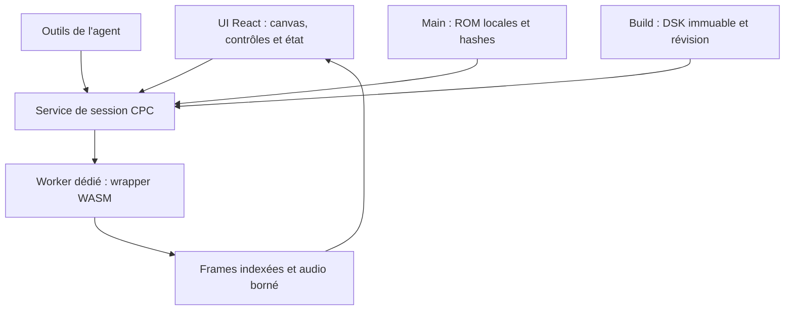

# Intégration propre du moteur CPC dans le micro-IDE

Date : 2026-10-03. Réponse technique à la demande produit ; plan d'intégration desktop, pas résultat de qualification. Références : [spécification machine](../specifications/06-emulateur-machines.md), [rapport J0](j0-report.md), [wrapper C](../../packages/emulator/src/cpc_bridge.h), [banc et recette](../../tools/j0-harness/README.md).

## Moteur retenu

Le cœur embarquable **floooh/chips**, `systems/cpc.h`, licence Zlib, est figé au commit `9e88298ce56319953ac7a43213a1120359f7a3a6`. Emscripten 4.0.15 compile notre wrapper C en WebAssembly. Le [lock](../../packages/emulator/chips.lock.json) et les notices fixent versions et hashes ; les sources upstream sont téléchargées/vérifiées, pas copiées dans une réécriture de moteur. Le projet primaire propose des systèmes embarquables en C et des exemples WASM : [chips](https://github.com/floooh/chips).

Ce n'est pas Caprice32 lancé dans une fenêtre externe. Caprice32 reste l'oracle indépendant prévu pour vérifier un DSK produit par l'IDE, avec version et firmware identifiés. Il n'est pas embarqué comme fallback silencieux. Un moteur de substitution demanderait une nouvelle ADR et une analyse de licence/distribution.

## Séparation des responsabilités

Le domaine ne connaît ni Electron ni pointeurs C. Le port de session expose initialise/boot/mount/key/input/pause/reset/capture/readDiskChanges/dispose, avec IDs, capacités et erreurs. Le wrapper est le seul module qui manipule mémoire/pointeurs WASM. L'UI et l'agent utilisent le même service de session ; ils ne pilotent jamais le processeur indépendamment.

Le worker a une file de commandes validées et sérialisées, IDs de requêtes, génération de session, deadlines et rejet des réponses tardives. Le canvas reste en renderer et reçoit des frames par buffers transférables ; une file bornée privilégie la dernière frame. Pas de SharedArrayBuffer ou headers COOP/COEP imposés au premier incrément. Le temps CPU est indépendant du repaint : tranches jusqu'à 20 ms, horloge 100 %, backlog borné et pas de rattrapage après veille.

Audio AY via paquets Float32 bornés puis AudioWorklet en renderer, activation explicite de l'utilisateur. Le mode muet ne stoppe pas les queues AY dans la machine. Clavier physique routé seulement avec focus CPC ; touches logiques espacées en temps émulé pour commandes. Perte de focus/pause/reset/fermeture relâchent touches et joystick. ESC/interruptions réelles passent par le mapping qualifié.

## Disques, ROM et démarrage

Le build produit un DSK immuable avec son hash et son point d'entrée. Le service crée une copie mutable de session, monte cette copie dans le lecteur A et conserve la révision réellement utilisée. Une écriture OPENOUT modifie la copie de session, jamais les fichiers sources ou l'artefact construit. L'export du disque joué vient des secteurs du moteur ; reconstruire le listing ne restituerait pas les données créées pendant le jeu.

Importer OS, BASIC 1.1 et AMSDOS séparément, chacun 16 384 octets, par sélecteur natif dans le main. Vérifier taille, SHA-256 et profil ; stocker localement par hash, hors projet/Git. Aucun téléchargement implicite ni transmission de ROM à OpenAI. Ne pas assimiler taille correcte à firmware compatible. Le profil 6128 et les jeux ROM restent candidats jusqu'à recette.

Le lancement attendu : initialiser avec firmware identifié, booter, observer le prompt qualifié, monter la copie DATA, injecter `RUN"<entrée CPC>"`, observer. Un délai arbitraire ou un framebuffer non vide ne prouve pas le prompt BASIC. Tant qu'il n'existe pas de signal ROM/VDU qualifié, demander la confirmation manuelle du prompt dans le banc et identifier cette observation comme manuelle.

## Ce qui existe et ce qui manque

| Élément | État réel |
| --- | --- |
| Wrapper C : init, mount, step, pause, reset, keys, joystick, frame/palette, audio, export/peek | Implémenté et testé sur fixtures synthétiques |
| Writer/reader DSK DATA standard et export des secteurs modifiés | Testés structurellement ; OPENOUT firmware non qualifié |
| Build C natif, WASM, transport Node et banc navigateur | CI disponible, preuves dans J0 |
| Worker de production, service de session et panneau machine Electron | À réaliser après qualification J0 ; le banc n'est pas ce panneau |
| Import desktop de ROM, jeux identifiés et reconnaissance du prompt | À réaliser/qualifier |
| Boot BASIC 1.1, CAT/RUN/LOAD, TIME/SOUND/INKEY, OPENOUT exporté puis relu | Bloqués en l'absence de firmware autorisé fourni pour la recette |
| Outils agent run/input/observe/control | Non exposés dans l'alpha 0.6 ; aucun succès simulé |

La géométrie actuellement acceptée par le wrapper est strictement standard DATA, 40 pistes, une face, neuf secteurs de 512 octets, IDs C1–C9. Extended/protections/disque B/Plus/664 sont hors capacité de cette tranche, même si certaines sources upstream offrent davantage. Une qualification CPC6128 ne sera pas transférée automatiquement aux autres modèles.

## Ordre concret de réalisation

1. Fournir un jeu autorisé OS/BASIC/AMSDOS local, vérifier hashes et rejouer le banc J0 : prompt, hello/probe, clavier, son, pause/reset, OPENOUT.
2. Exporter le disque joué, relire `RESULT.TXT` avec le codec puis dans Caprice32 externe ; produire captures/rapport et décider le go moteur.
3. Développer service/worker et messages bornés, intégrer ROM locales et panneau Electron, rejouer synthétique puis firmware sans changer les couches métier.
4. Brancher build/entrée dans le service ; séparer artefacts construits et joués, inclure interruptions, délais, audio et focus dans la recette desktop.
5. Ajouter les outils agent sur ce service avec budgets, capture et observation à provenance ; test absent/inconnu/timeout reste un résultat de blocage.

Pas de changement du moteur justifié par la seule absence de ROM. Si un essai discriminant échoue, conserver cas/artefact/hashes, corriger le wrapper ou évaluer une alternative avant intégration. La clé API permet l'agent de code ; elle ne lève pas la dépendance firmware de l'exécution CPC.
