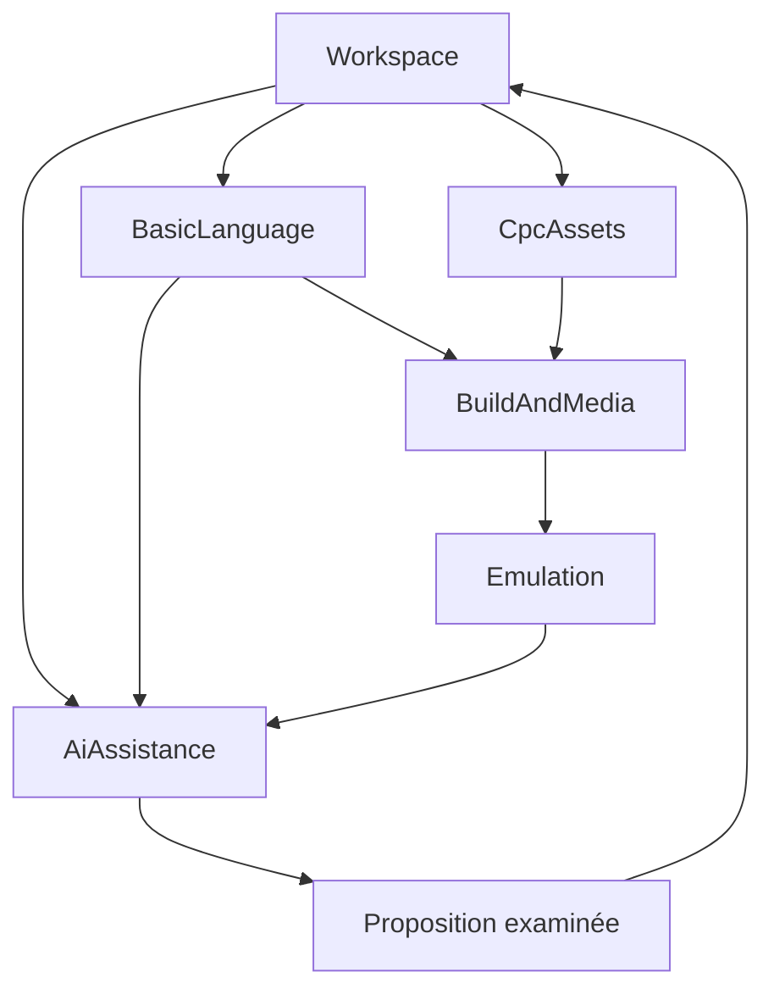

# 03 — Domaines, modèle métier et DDD

## Stratégie

Le cœur de valeur est la **création assistée de programmes CPC livrables**. L'architecture est un monolithe modulaire : les frontières sont utiles pour raisonner et tester, pas pour distribuer le produit sur des microservices. Les agrégats protègent des invariants locaux ; les cas d'usage coordonnent plusieurs contextes sans transaction géante couvrant le disque, un réseau et l'émulateur.

| Contexte | Responsabilité | Concepts principaux | Statut |
| --- | --- | --- | --- |
| Workspace | Organiser le travail et ses révisions | Project, SourceDocument, ProjectRevision, EntryPoint | Support |
| BasicLanguage | Comprendre et transformer le langage | BasicProgram, BasicLine, LineReference, Diagnostic | Cœur |
| CpcAssets | Produire des ressources adaptées à la machine | AssetRecipe, CpcAsset, Palette, LoadAddress | Cœur |
| BuildAndMedia | Préparer la livraison CPC | BuildPlan, BuildArtifact, DiskCatalog, CpcFilename | Cœur |
| Emulation | Faire vivre une machine et sa session | MachineProfile, EmulatorSession, SessionDisk | Support spécialisé |
| AiAssistance | Contextualiser et proposer des changements | ContextBundle, AiRequest, ChangeProposal, AppliedChange | Cœur |
| ReferenceKnowledge | Fournir des références qualifiées | CommandDefinition, DialectProfile, Provenance | Support |
| Platform | Accès fichiers, secrets, UI et packaging | Adaptateurs techniques | Infrastructure |

## Relations entre contextes

Les flèches signifient données publiées ou orchestration applicative, pas imports directs entre agrégats. Workspace transmet une révision immuable. BasicLanguage publie diagnostics et transformations, CpcAssets publie ressources encodées, BuildAndMedia publie artefacts, Emulation publie captures et observations explicitement sélectionnées. AiAssistance ne devient jamais le propriétaire des sources.

La couche anticorruption de l'émulateur traduit les API C en commandes métier de session ; celle de l'IA traduit les réponses fournisseur en propositions validées. Le format DSK appartient au domaine média et à son codec, pas à l'état interne du moteur.

## Agrégats et invariants

### Project

Racine : `ProjectId`, `schemaVersion`, nom, profil, documents, ressources, point d'entrée et configuration de construction. Le fichier d'entrée existe et fait partie des sources. Les identifiants restent stables après renommage. Les chemins sont relatifs au projet, normalisés et non sortants. Les noms CPC sont uniques dans le catalogue actif, sans confusion par casse. Les références de documents et de recettes sont valides. Les ROM, clés et préférences machine hôte ne sont jamais contenues dans cet agrégat.

Une `ProjectRevision` capture manifeste, octets des sources et ressources pertinentes, empreintes et numéro de révision. Elle est immuable. Le contenu peut être identique à une révision précédente tout en ayant une nouvelle révision de travail ; l'empreinte de construction élimine ce qui n'affecte pas le résultat. L'état « modifié dans l'éditeur » appartient à l'application, jusqu'à sa matérialisation en révision.

### BasicProgram

Il représente un listing parsé pour un dialecte identifié. Les lignes stockées ont des numéros uniques entre 1 et 65535. Leur ordre suit le contrat du mode d'édition explicite : ordre strict attendu ; réordonner une importation nécessite aperçu. Les références syntaxiques sont des objets typés, pas tous les entiers trouvés par expression régulière. Une transformation expose ancienne/nouvelle numérotation, changements de références et diagnostics. Elle refuse le débordement et les collisions.

L'AST incomplet conserve les zones non comprises ; il sert à l'édition mais n'autorise pas un refactoring destructif. Une ligne en erreur ne rend pas inutilisable le reste du document. Les règles de version, d'encodage et de taille sont des politiques explicites distinctes de l'état utilisateur.

### AssetRecipe

La recette lie une source importée immuable à un mode, une palette, un cadrage, un tramage, un algorithme versionné et une destination CPC. Son résultat `CpcAsset` porte contenu, longueur, empreinte et adresse de chargement. Une image de contexte ne devient une ressource CPC que par un cas d'usage dédié. Une palette est indexée par numéro d'encre ; elle ne confond pas numéro BASIC et code matériel Gate Array.

### BuildPlan et DiskCatalog

Un plan sélectionne révision, dialecte, point d'entrée, format disque et fichiers embarqués. Le catalogue vérifie capacité, allocation et unicité. Un artefact n'est publié qu'après construction et validation complètes. Les données ASCII, binaires et tokenisées utilisent leur convention d'en-tête propre. Le disque source d'une session et sa copie mutable sont deux identités distinctes.

`BuildId` identifie une tentative ; `inputFingerprint` identifie des entrées reproductibles. Une construction échouée peut avoir un rapport et ne possède pas d'artefact valide. Un fichier existant d'une construction antérieure n'est jamais réétiqueté comme le résultat d'une tentative échouée.

### EmulatorSession

La session appartient à un profil et à une révision exécutée. Ses états sont `unconfigured`, `ready`, `booting`, `running`, `paused`, `faulted`, `disposed`. `running` veut dire horloge machine active, pas nécessairement programme BASIC en cours : le CPC peut être au prompt ou attendre INPUT. L'observation BASIC `unknown|prompt|executing|break|error` est séparée et porte une confiance.

Une seule commande de mutation du moteur est traitée à la fois. Reset invalide les observations et les clés pressées. Une capture est liée à une session, une révision et un instant émulé. Une sauvegarde de session interne est compatible uniquement avec la version du moteur et les ROM attendues ; elle n'est pas un fichier SNA public par défaut.

### ChangeProposal

La proposition appartient à une requête, un contexte, une révision de base et un ensemble fini d'opérations `create` ou `replace`. Le MVP n'autorise pas suppression ni changement de manifeste par l'IA. Chaque remplacement exige l'empreinte du fichier de base ; une création exige son absence. Les chemins autorisés désignent uniquement sources et, lorsque le cas d'usage le permet, texte de ressources. Aucun texte de réponse ne peut ajouter un nouveau droit.

Son état suit `collecting → validated → reviewed → applied`, avec branches `failed`, `cancelled`, `stale`, `rejected`. Une proposition complète peut contenir des diagnostics bloquants ; elle est visible mais non applicable jusqu'à correction. L'application vérifie à nouveau toutes les préconditions, stocke une sauvegarde transactionnelle puis enregistre les documents. Le retour arrière est une nouvelle opération contrôlée, pas une réécriture de l'historique.

## Valeurs et événements

| Objet valeur | Protection apportée |
| --- | --- |
| CpcFilename | Politique 8.3, casse, caractères, collision |
| BasicLineNumber | Plage, comparaison et conversion sûre |
| RelativeProjectPath | Chemin portable, normalisation, absence de traversal |
| ContentHash | SHA-256 et identification des entrées |
| MachineProfileId | Capacités stables et version du profil |
| SourceRange | Document, ligne physique et offsets ; liens diagnostic |
| MemoryRegion | Intervalle sans débordement, conflits de chargement |
| CapabilitySet | Opérations réellement disponibles par adaptateur |

Événements applicatifs : `ProjectOpened`, `RevisionCaptured`, `AnalysisCompleted`, `BuildCompleted`, `BuildFailed`, `SessionStarted`, `RuntimeObservationReceived`, `SessionDiskChanged`, `ProposalReady`, `ProposalApplied`. Ce sont des notifications en mémoire avec payload immuable et identifiant de corrélation. Aucun event sourcing ni bus distribué n'est requis. Un résultat périmé est ignoré si sa révision ne correspond plus au contexte d'affichage.

## Cas d'usage et transactions

`RunProject` orchestre capture de révision, analyse, construction, préparation session et lancement. Un échec avant lancement préserve la session précédente. Le passage à une nouvelle session est explicite si elle possède des écritures disque non exportées. `ExportBuild` écrit une copie vérifiée ; `ExportSessionDisk` sérialise une provenance mutable. `RequestAiAssistance` fige le contexte avant réseau ; `ApplyProposal` revalide les documents après réseau.

Les transactions métier s'arrêtent à un ensemble de fichiers cohérent. Les appels IA et la machine ne participent pas à une transaction disque : ils utilisent des états observables, annulations et compensations. Un résultat fournisseur n'est pas automatiquement durable ; une tentative de construction n'est pas une sauvegarde du projet. Cette séparation garde le système compréhensible et récupérable.
