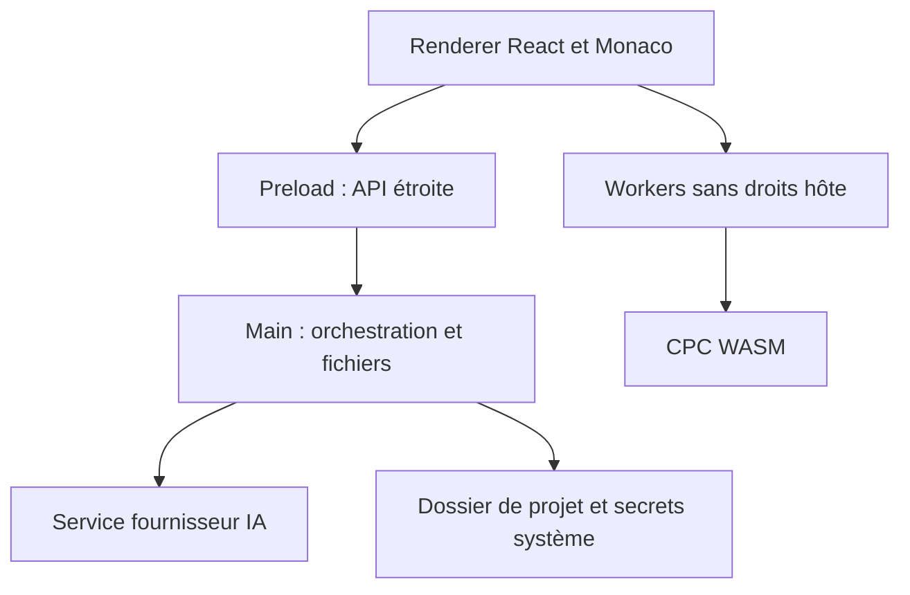

# 04 — Architecture technique

## Stack retenue

| Besoin | Technologie | Raison et limite |
| --- | --- | --- |
| Application de bureau | Electron stable maintenu | Même runtime Chromium sur les hôtes, fichiers et packaging maîtrisables ; coût mémoire accepté et mesuré |
| UI | React + TypeScript strict | État explicite, composants réutilisables, contrats partagés ; aucun calcul lourd pendant le rendu |
| Éditeur | Monaco Editor, ESM | Modèles, diagnostics et providers ; ne promet pas la compatibilité avec les extensions VS Code |
| Bundling | Vite + Electron Forge | Dev et distribution ; séparer bundles main, preload, renderer et workers |
| Monorepo | pnpm workspaces | Dépendances internes explicites, un lockfile ; pas de Nx/Turborepo initialement |
| Langage | Lexer/parser TypeScript propre, modules séparés | Exactitude des transformations ; réutilisation ciblée de CPCBasicTS seulement après audit et qualification |
| Émulateur | C `floooh/chips` → WebAssembly par Emscripten | Intégration compacte, Z80 et CPC ; wrapper et limites qualifiés à J0 |
| Conversion d'image | Pipeline déterministe TypeScript, décodeur local | Résultat versionné ; quantification indépendante du fournisseur IA |
| PDF | PDF.js, worker dédié | Extraction et rendu locaux ; pas de JavaScript embarqué du PDF |
| IA initiale | Adaptateur OpenAI Responses API | Multimodal configurable ; pas de modèle ni de tarifs figés dans le métier |
| Données | JSON + fichiers UTF-8 + objets par empreinte | Projets déplaçables ; SQLite inutile au démarrage |
| Validation | JSON Schema 2020-12, Ajv futur côté app | Contrats d'entrée ; règles métier supplémentaires en TypeScript |
| Tests futurs | Vitest, Playwright/Electron, harness WASM | Adapter le niveau de test au comportement, avec oracle indépendant |

Les versions applicatives seront choisies et verrouillées à J1, puis maintenues : ne pas publier un `package.json` de conception qui ferait croire à une stack installée. Le commit de `chips` inspecté est référencé dans [les sources](../reference/sources.md) ; J0 doit figer celui effectivement testé et produire son empreinte WASM. Des compilateurs compatibles ne remplacent pas une qualification.

## Processus et privilèges

Le renderer n'a ni Node.js ni accès arbitraire aux fichiers. `contextIsolation: true`, `sandbox: true`, `nodeIntegration: false`, `webSecurity: true` sont requis. Le preload expose des méthodes typées par cas d'usage, sans `ipcRenderer` brut. Le main vérifie canal, émetteur, schéma, état et droits de chaque commande. Les chemins renderer sont des identifiants de document ; le main résout les chemins effectifs.

L'émulation s'exécute dans un Web Worker du renderer, avec module WASM local et messages validés. Analyse BASIC, conversion et PDF ont leurs workers séparés ou un pool contrôlé. Un worker n'accède pas à Node ; un crash ne doit pas corrompre le projet. Un processus utilitaire dédié est une option d'isolation supplémentaire si J0/J6 montrent que les workers ne suffisent pas ; son API serait également limitée, et il ne serait pas réputé sandboxé par sa seule existence.

Les requêtes fournisseur partent d'un service applicatif côté main, qui possède la clé et transmet uniquement le contexte accepté. Le renderer voit l'identifiant du fournisseur et le statut de configuration, pas le secret. Le main ne parse ni PDF ni contenu HTML non fiable. Il ne lance aucun code proposé par l'IA sur l'hôte.

## Frontières des modules

Arborescence prévue, non encore créée : `apps/desktop`, `packages/workspace`, `packages/basic-language`, `packages/cpc-assets`, `packages/build-media`, `packages/emulation-contracts`, `packages/ai-assistance`, `packages/reference-knowledge`, `packages/platform-adapters`, `native/cpc-wasm`. Chaque package métier contient domain et application ; les adaptateurs techniques sont séparés.

Les domaines importent uniquement des types ou valeurs de leur contexte et un noyau partagé minimal : identifiants, empreintes, résultats et diagnostic de base. Le noyau ne contient pas des services universels. L'application compose les ports. L'UI dépend des DTO et cas d'usage, jamais du layout mémoire C. Le module AI ne dépend pas du SDK dans sa partie domaine. Les codecs de disque peuvent être testés sans Electron.

Les analyses portent `documentVersion` et `projectRevision`; les réponses dépassées sont abandonnées. Un seul build actif par projet ; une nouvelle demande peut annuler le précédent avant publication. Les transactions de projet sont sérialisées. L'IA peut générer pendant une exécution, mais aucune application de proposition ne remplace la révision en cours d'émulation implicitement.

## Échanges et rendu

La vidéo utilise un framebuffer transférable copié depuis WASM vers le canvas. Le mode initial évite SharedArrayBuffer : il ne réclame pas COOP/COEP et suffit si les mesures le confirment. Un double tampon limite les allocations ; un numéro de frame permet de jeter les frames obsolètes. Le worker reste maître de l'horloge émulée ; `requestAnimationFrame` affiche mais ne détermine pas la précision de TIME/EVERY.

Le son est produit par le cœur et consommé par un AudioWorklet local avec tampon borné. Sous-débit et sur-débit sont comptabilisés. Les pauses vident la file audio et relâchent les touches. À la reprise après mise en veille de l'hôte, le logiciel reprend le temps émulé sans tenter de simuler toute la durée écoulée d'un coup.

L'IPC applique des limites de taille ; les gros objets passent par handles et chargement contrôlé, pas par répétition de base64 dans chaque événement. Chaque commande possède `requestId`, version de protocole et signal d'annulation. Les abonnements sont disposés à la fermeture d'un projet ou d'une vue.

## Fichiers et réseau

Enregistrer passe par fichier temporaire local au même volume, flush lorsque possible, puis remplacement. Une transaction multifichier possède un journal de récupération : le remplacement de plusieurs fichiers n'est pas présumé atomique par le système d'exploitation. Les chemins sont vérifiés après résolution des liens symboliques et jonctions. Les dossiers autorisés sont le projet, le stockage applicatif et les destinations choisies par dialogues natifs.

Le protocole applicatif local sert les scripts et workers du paquet. CSP : scripts locaux, pas d'eval, réseaux renderer refusés, exceptions minimales pour compilation WASM documentées. Les Markdown et messages IA sont rendus avec HTML désactivé ou assaini ; aucun HTML utilisateur n'est chargé comme page privilégiée. Une URL externe est analysée et ouverte seulement sur action utilisateur.

Le réseau autorisé concerne le fournisseur configuré, les vérifications de mise à jour demandées et les liens ouverts. Aucun téléchargement ROM automatique, aucune télémétrie et aucun CDN de composants UI. Pour un fournisseur local futur, seule une adresse explicitement configurée peut être jointe ; elle n'est jamais extraite d'un document.

## Distribution et sécurité opérationnelle

Electron Forge réalise les paquets sur runners des plateformes visées. Windows : installateur Squirrel et archive de diagnostic si utile. macOS : archive et DMG avec signature/notarisation pour diffusion officielle. Linux : paquet deb et archive qualifiée. Les architectures additionnelles restent des livraisons séparées. La signature requiert les certificats du propriétaire ; les builds non signés sont identifiés comme tels.

Le runtime est embarqué ; l'utilisateur n'installe ni Node ni Emscripten. Les ROM et clés restent dans les données utilisateur, hors installation et hors projet exporté. La désinstallation préserve les projets. Les updates vérifient la provenance et ne sont pas appliquées au milieu d'une transaction ; la version 1.0 peut proposer une mise à jour manuelle avant un auto-updater.

Le choix Electron et le choix WASM sont des décisions de réalisation, pas l'exigence d'un serveur web. Les API métier restent réutilisables si une édition web ou un autre shell est demandé ultérieurement, sans imposer une double implémentation aujourd'hui.
