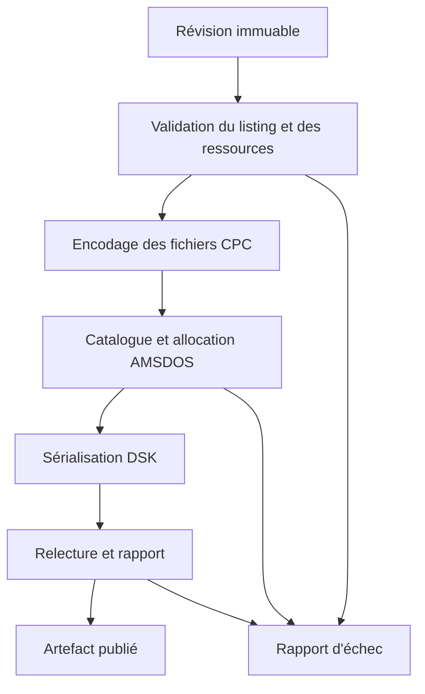

# 07 — Construction, fichiers CPC et disquettes DSK

## Chaîne de construction

Chaque phase peut échouer sans publier une sortie partielle. Le rapport contient identifiant de tentative, empreinte d'entrée, profil, versions d'outils, fichiers inclus, tailles, diagnostics et empreinte du résultat. L'heure de génération peut figurer dans le rapport mais pas dans les octets déterministes du DSK.

Le plan choisit un seul programme de démarrage. Plusieurs listings peuvent être sur le disque pour LOAD, RUN ou CHAIN ; ils ne sont pas concaténés ou « liés » automatiquement. Les références entre programmes sont explicites. Les fichiers de contexte IA sont absents du plan sauf conversion et inclusion volontaires.

## Listing ASCII CPC

Première sortie supportée : listing de lignes numérotées, encodé selon la politique CPC, CRLF et fin logique `0x1A` qualifiée par essai. Les espaces et commentaires sont conservés sauf normalisation approuvée. La source UTF-8 reste distincte. Une conversion de caractère non représentable bloque jusqu'au choix de l'utilisateur ; la translittération ne s'applique pas silencieusement aux données du programme.

Un BASIC ASCII non protégé est un fichier sans en-tête AMSDOS. L'en-tête binaire n'est donc pas collé devant tous les fichiers ayant `.BAS`. Le chargement ROM est responsable de la tokenisation. La sortie ASCII peut occuper davantage de disque que la future sortie tokenisée ; le rapport donne la taille réelle. `RUN"MAIN.BAS"` est la commande par défaut. Le format DATA ne fournit pas un démarrage CP/M : « lancer automatiquement dans l'IDE » n'est pas « disquette bootable au démarrage de toute machine ».

## Noms et types

Politique MVP : noms CPC en majuscules, partie 1–8 caractères, extension 0–3 ; alphabet conservateur `[A-Z0-9_]`. Il est plus restreint que certaines possibilités AMSDOS pour favoriser la portabilité. La conversion d'un nom long est proposée, jamais silencieuse. Les comparaisons ignorent la casse ; `MAIN.bas` et `main.BAS` ne sont pas deux fichiers distincts. Les caractères de commande, chemins hôte et wildcards sont refusés dans un nom de catalogue.

| Type produit | Extension conseillée | En-tête | Particularité |
| --- | --- | --- | --- |
| BASIC ASCII | BAS | Aucun | Fin logique et padding CP/M distincts |
| BASIC tokenisé futur | BAS | AMSDOS type BASIC | Codec natif qualifié |
| Binaire chargé par LOAD | BIN ou SCR | AMSDOS type binaire | Adresse de chargement et longueur |
| Données texte | DAT ou TXT | Aucun | Lecture OPENIN, format défini par le programme |

Les extensions ne déterminent pas seules le type. Un fichier BIN peut être une image ou des données ; sa recette porte l'adresse et l'utilisation. Les fichiers protégés ne sont pas générés au MVP.

## Géométrie et capacité de référence

Le format choisi est **DSK standard + AMSDOS DATA**, deux niveaux distincts. DATA : 40 pistes, 1 face, 9 secteurs/piste, 512 octets/secteur, IDs `0xC1` à `0xC9`, aucune piste système réservée. Allocation CP/M en blocs de 1024 octets, répertoire de 64 entrées de 32 octets. Les deux blocs du répertoire sont réservés ; 178 blocs restent pour les fichiers.

| Mesure | Calcul | Valeur |
| --- | --- | --- |
| Données sectorielles | 40 × 9 × 512 | 184 320 octets, 180 Kio |
| Répertoire | 64 × 32 | 2 048 octets |
| Capacité allouable | 178 × 1 024 | 182 272 octets, 178 Kio |
| Bloc de piste DSK | 256 + 9 × 512 | 4 864 octets, `0x1300` |
| Taille fichier DSK | 256 + 40 × 4 864 | 194 816 octets |

Les en-têtes de fichiers et l'arrondi au bloc consomment la capacité allouable ; les en-têtes DSK ne la consomment pas. Le nombre d'entrées restantes peut bloquer avant le nombre d'octets libres. La face opposée d'une disquette physique 3 pouces n'est pas un deuxième lecteur ou une deuxième face automatiquement accessible : la cible initiale reste une seule face logique.

## Catalogue CP/M et allocation

Le writer implémente utilisateurs (0 initialement), noms et extensions, flags, numéro d'extent, nombre de records de 128 octets et numéros de blocs. Un extent DATA décrit jusqu'à 16 Kio avec 16 blocs d'un Kio ; un fichier supérieur requiert plusieurs entrées. Un fichier ne reçoit donc pas toujours « une entrée et une longueur ».

L'allocation réserve blocs 0 et 1, affecte les suivants par ordre stable de nom CPC et traite correctement la fin d'extent. Les entrées libres portent la convention de suppression `0xE5`. Les zones inutilisées sont remplies de façon déterministe ; les fichiers ASCII distinguent fin logique et padding. Les fichiers binaires se relisent à leur longueur AMSDOS, pas à leur longueur arrondie au record. Les fichiers vides, limites de record, de bloc et d'extent ont des fixtures spécifiques.

Les secteurs sont identifiés par leur ID, non par leur seul index physique. L'ordre physique d'interleave est figé dans le profil writer et testé sur lecteur indépendant ; le contenu logique est affecté selon l'ordre de records attendu. Une disposition séquentielle ou un interleave 2:1 peut être choisi à J0, mais cette décision change la version du writer et ses fichiers étalons.

## DSK standard et validation

Le conteneur comprend un en-tête disque de 256 octets, les blocs de pistes, leurs en-têtes de 256 octets et descripteurs secteurs CHRN/statuts. La signature standard est celle de CPCEMU. Le champ taille piste est little endian et inclut l'en-tête de piste. Le créateur est une chaîne ASCII stable bornée à son champ. Les secteurs DATA ont `N=2`, statuts normaux et tailles homogènes.

Avant publication, un reader indépendant du writer dans son parcours relit offsets, signatures, géométrie, IDs, bornes, répertoire, allocation et contenu. Comparer seulement le fichier au buffer avant écriture ne prouve pas sa structure. Les empreintes des fichiers extraits doivent correspondre aux fichiers CPC encodés avant allocation, en tenant compte de leurs conventions de longueur.

## En-tête AMSDOS

Pour les fichiers qui en nécessitent un, l'en-tête est de 128 octets. Il comporte notamment nom, type, adresse de chargement, longueur logique, entrée éventuelle et longueur réelle 24 bits ; son checksum est calculé sur les 67 premiers octets et stocké little endian. Le codec vérifie bornes et cohérence avant d'exposer un contenu binaire.

La présence d'un checksum valide est un indicateur, pas une preuve absolue du type : un fichier sans en-tête peut coïncider accidentellement. L'inspecteur présente donc sa décision et permet l'import brut. Une image écran standard de 16 Kio à `&C000` possède une longueur explicite ; un entry point n'est pas inventé pour des données sans code.

## Disques externes et session mutable

Le reader détecte standard ou Extended, puis distingue géométrie comprise, catalogue lisible, fichier importable et disque réellement exécutable par le moteur. Extended utilise des tailles de piste variables ; pistes absentes, secteurs atypiques et statuts de protection exigent des contrôles. Le MVP n'écrit pas de protections et ne réexporte pas un disque exotique en prétendant le préserver.

Les DSK externes sont copiés ou ouverts en lecture seule. Les imports sélectionnent les fichiers compréhensibles ; chaque extraction garde une provenance et laisse l'original intact. Le BASIC tokenisé non encore supporté peut être monté pour exécution, mais n'est pas transformé arbitrairement en listing éditable.

La session dispose d'un DSK mutable distinct. OPENOUT, SAVE ou `|ERA` peuvent en changer les secteurs. L'export de session ne reconstruit pas le disque à partir des sources : il sérialise les secteurs du profil supporté, annonce les modifications et attache un rapport de session. Un reset n'exporte pas automatiquement. Une reconstruction ne supprime pas silencieusement les données écrites pendant un essai.

## Déterminisme, export et vérification externe

La clé de construction comprend sources, ressources sélectionnées, recette, profil d'encodage, dialecte, géométrie et versions des codecs. Elle exclut préférence de thème, conversation IA et date locale. Aucun fichier précédemment trouvé dans `dist` n'entre implicitement sur le disque.

Export : écrire temporaire, relire et vérifier, remplacer la destination choisie. Une erreur conserve le fichier précédent et fournit un message récupérable. Le rapport distingue artefact validé structurellement, lancé dans le moteur intégré, essayé ailleurs et essayé sur matériel physique. Pour qualifier 1.0, CAT, RUN, lecture binaire et données sauvegardées sont testés dans un autre émulateur. La compatibilité sur CPC réel n'est affichée comme testée qu'avec un rapport matériel effectif.
