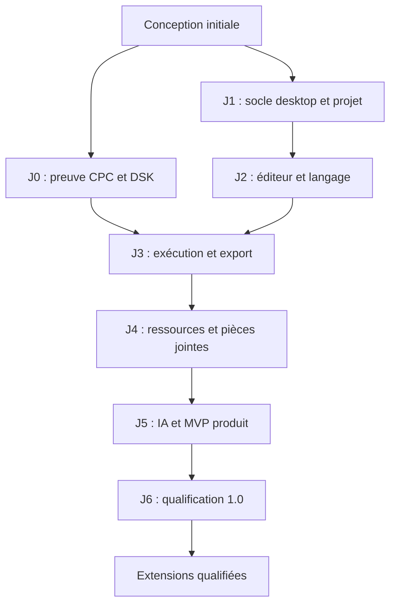

# 12 — Feuille de route et backlog de réalisation

Demande du 6 octobre : explorer l’intégralité du projet, retrouver les sorties en bas et adapter l’IDE aux habitudes de chacun. La tranche 0.25 ajoute préférences persistantes, auto-save opt-in, journal des commits en bas et formulaire de retour utilisateur (issues GitHub). La tranche 0.26 ajoute séparateurs et panneaux flottants persistants dans l’IDE, ainsi que commandes CPC en colonne et zoom. Suite explicite : arbre complet avec fichiers non BASIC et vues adaptées, fenêtres système indépendantes, ancrage sur un autre côté, PTY, journaux d’opérations et keymap. Une réorganisation d’interface ne suffit pas à qualifier la production.

## Mode de progression

## Priorité ergonomie — alpha 0.25, 6 octobre 2026

La demande utilisateur priorise l’[atelier 0.25](../implementation/production-workbench-alpha.md) : colonne IA dédiée, outils/Git à gauche, menus exclusifs, icônes, raccourcis et diagnostics avant exécution. [ADR 0030](../adr/0030-atelier-menus-diagnostics.md). IDE-014/026/027/028 restent partiels : le parser couvre des expressions et instructions courantes, sans validation exhaustive ; paramètres et dimensions persistés sont livrés selon l’ADR 0032 ; la disposition 0.26 est décrite par l’ADR 0033 ; fenêtres système indépendantes, explorateur intégral, keymap et Git branches/réseau restent ouverts.

## Priorité Exécuter — alpha 0.24, 5 octobre 2026

À la demande utilisateur, [Exécuter/F5 dans le CPC intégré](../implementation/emulator-run-alpha.md) passe avant la suite Git. [ADR 0029](../adr/0029-executer-buffers-cpc-integre.md) : worker chips/WASM, DSK des buffers, trois ROM privées, écran/clavier/pause/arrêt/son/export session et RUN automatique pour le jeu anglais reconnu (Ready manuel sinon). Boot BASIC 1.1, RUN disque et POKE sont prouvés sur le jeu identifié ; pixels PRINT vérifiés par recette UI. 157 tests Node ; preuves Electron dans la PR. J0/J3 restent partiels, oracle indépendant/OPENOUT/audio audible/autres plateformes ouverts ; aucun CPC physique qualifié. Suite immédiate : renforcer les recettes CPC, avant branches Git et outils d’exécution IA.

R2 avance en alpha 0.21 : [journal des mutations agent](../implementation/agent-durability-alpha.md), créations/remplacements/renumérotation et restauration courante, reprise native et versions avant/proposées dans l’historique ([ADR 0026](../adr/0026-journal-durable-des-mutations-agent.md)). Les arrêts de processus Linux sont testés ; R2/J1-03/ACC-02 restent partiels. Suite prioritaire : identité et commit Git local avant réseau/changements de branche.

R2 avance en alpha 0.20 : [revue des changements externes](../implementation/external-alpha.md), détection par empreintes, comparaison et adoption explicite avec buffers/undo conservés ([ADR 0025](../adr/0025-revue-des-modifications-externes.md)). IDE-012 devient partiel. Prochaine tranche : checkpoints durables des mutations agent, puis identité/commit Git ; R2 et qualification moteur restent ouverts.

R2 avance en alpha 0.19 : [copie optionnelle des brouillons](../implementation/drafts-alpha.md), reprise sélective dans les buffers avec undo et tests SIGKILL ([ADR 0024](../adr/0024-copie-brouillons-et-reprise-buffers.md)). IDE-011 devient partiel. Suite prioritaire : IDE-012 détection/revue contrôlée des modifications externes, puis extension des checkpoints aux mutations agent avant checkout Git.

R2 avance en alpha 0.18 : [historique local](../implementation/local-history-alpha.md), snapshots/rétention, comparaison et restauration réversible d’une source dans le buffer ; actif/global partagent le journal ([ADR 0023](../adr/0023-historique-local-et-restauration-buffer.md)). IDE-009/010 deviennent partiels. Suite : récupération des brouillons, watcher externe et extension aux mutations agent avant les changements de branche Git.

R2 avance en alpha 0.17 : [journal/reprise des sauvegardes globales](../implementation/recovery-alpha.md), choix natif explicite et arrêts SIGKILL Linux ([ADR 0022](../adr/0022-journal-sauvegarde-et-reprise.md)). IDE-008 devient partiel ; historique local IDE-009/010 et autres mutations suivent. Ni durabilité universelle ni atomicité de projet ne sont annoncées.

R2 commence en alpha 0.16 : [Enregistrer tout](../implementation/save-all-alpha.md), snapshot de sources complet et compensation en mémoire ([ADR 0021](../adr/0021-enregistrer-tout-compensation.md)). IDE-007/J1-03 restent partiels ; journal/reprise IDE-008 puis historique local IDE-009/010 suivent. Ce succès ne qualifie pas une sauvegarde atomique de projet ni un crash recovery.

Le [backlog produit qualifié 17](17-roadmap-ide-complet.md) recense les 75 capacités nécessaires ou avancées, leurs priorités/états/critères et l’ordre des lots R1–R9. À la demande produit, la suite commence par recherche/remplacement global, puis durabilité/historique local et Git local complet ; les dépendances J0–J6/JG ci-dessous restent applicables.

Demande produit du 4 octobre : outils d’IDE adaptés au CPC. La [tranche atelier 0.14](../implementation/workbench-alpha.md) livre palette/menus/contextes, ouverture rapide, réglages de code, historique Git paginé et terminal humain sans PTY ([ADR 0019](../adr/0019-outils-atelier-et-terminal-humain.md)). Elle contribue à J2/JG-A sans les fermer. La [recherche 0.15](../implementation/search-alpha.md) commence R1 : buffers chargés/brouillons, navigation et remplacement avec aperçu/undo par source ([ADR 0020](../adr/0020-recherche-sources-et-remplacement-buffers.md)). La suite prioritaire est durabilité/historique local, puis commit/identité et réseau Git ; les outils machine attendent toujours J0.

J0 reste en HOLD pour la qualification moteur. Une tranche indépendante J1/J2 livre l'[alpha d'édition 0.4](../implementation/editor-alpha.md), conformément à l'[ADR 0009](../adr/0009-edition-independante.md) : elle n'annonce pas J1/J2 complets. Le [rapport J0](../implementation/j0-report.md) conserve les preuves et limites. Chaque jalon dispose d'une branche, d'une PR ciblée, de documents actualisés et d'une démonstration reproductible. Aucun planning calendaire ou volume horaire n'est fixé sans estimation de l'équipe et disponibilité des dépendances.

## J0 — Lever les risques d'exécution et de livraison

Livrer un harness minimal, pas un IDE. Figer le cœur C et Emscripten, importer des ROM autorisées, construire un DSK ASCII, booter, exécuter et extraire les écritures disque. Mesurer les points sensibles du moteur. Vérifier le disque dans un émulateur indépendant.

| Tâche | Dépendance | Critère de sortie |
| --- | --- | --- |
| J0-01 — Audit du cœur et licences, pin de commit | Aucune | Inventaire, limites, hashes et procédure de build |
| J0-02 — Wrapper WASM et validation binaire | J0-01 | Boot qualifié, erreurs d'entrée sans crash |
| J0-03 — Writer/reader DATA minimal | Aucune | DSK hello structurellement valide et déterministe |
| J0-04 — RUN, clavier, vidéo, son et contrôle | J0-02, J0-03 | ACC-08/09/24 techniques documentés |
| J0-05 — OPENOUT et sérialisation disque modifié | J0-04 | Fichier écrit relu dans émulateur indépendant |
| J0-06 — Rapport go/no-go moteur | Tous J0 | Écarts classés, ADR confirmée ou remplacée |

Condition d'arrêt pour l'intégration de l'exécution : pas de ROM utilisable, pas de lecture DSK fiable, pas de récupération des écritures nécessaires ou performances insuffisantes non résolues. Un résultat no-go donne un rapport exploitable et une alternative. L'édition indépendante est autorisée par l'ADR 0009, sans supposer une compatibilité moteur. Le harness reste un banc local, pas un Site hébergé.

## J1 — Socle desktop et projets

L'[alpha ROM 0.7](../implementation/firmware-alpha.md) réalise une partie de J1-04 : import séparé local, empreintes et configuration persistante, indépendamment de J0 selon l'[ADR 0012](../adr/0012-configuration-rom-locale.md). Aucun moteur n'est qualifié par cette préparation.

Fixer versions de runtime, installer monorepo, shell Electron sécurisé et composition des modules. Créer/ouvrir/enregistrer le projet hello ; intégrer contrats, résolution de chemins, journal transactionnel et détection de modifications externes. Mettre en place CI code et règles d'import.

| Tâche | Dépendance | Critère de sortie |
| --- | --- | --- |
| J1-01 — Workspaces, builds et qualité | Conception ; ADR 0009 | Versions figées, builds main/preload/renderer/workers distincts |
| J1-02 — Cas d'usage Workspace et manifeste | J1-01 | ACC-01 et contrôles de chemins/existence |
| J1-03 — Sauvegarde, conflits et migrations | J1-02 | ACC-02, reprise multifichier élémentaire |
| J1-04 — Shell et configuration ROM | J1-01 | Sécurité IPC, profil lisible et secrets hors renderer |
| J1-05 — CI architecture | J1-01 | ACC-21 ; domaines testables sans Electron |

Sortie : application ouvrable et projets durables, sans annoncer un éditeur BASIC complet. Les données de test ne contiennent aucun secret ou firmware redistribué sans droit.

## J2 — Éditeur BASIC utile

L'[alpha 0.8](../implementation/renumber-alpha.md) contribue à J2-04 : renumérotation d'un sous-ensemble documenté, aperçu, révision et annulation ; même outil pour l'agent. ACC-05 reste partiel (formes opaques, parser complet et recette ROM ouverts).

Intégrer Monaco, coloration et services de langage qualifiés. Développer lexer/parser avec fixtures prioritaires et zones opaques explicites. Relier diagnostics à la source. Fournir renumérotation sûre et aide contextualisée.

| Tâche | Dépendance | Critère de sortie |
| --- | --- | --- |
| J2-01 — Modèles Monaco et buffers | J1 | ACC-03, dirty state et annulation |
| J2-02 — Lexer/parser et diagnostic | J2-01 | ACC-04, analyse partielle non destructrice |
| J2-03 — Commandes et profils de langage | J2-02 | Fiches sourcées et variantes prouvées |
| J2-04 — Références et renumérotation | J2-02 | ACC-05, collisions et révision vérifiées |
| J2-05 — Corpus initial, index et fiches de langage | J2-02 | ACC-30 : sources conservées, couverture et qualification explicites |

Sortie : l'utilisateur peut écrire et comprendre un listing réel. Le parser n'est pas réputé complet parce que quelques programmes se colorent correctement.

## J3 — Boucle locale complète

Brancher le pipeline de construction et le moteur qualifiés dans l'UI. Construire depuis une révision, contrôler le cycle de session, afficher catalogue et rapport, exporter source et DSK. Importer/inspecter les DSK supportés. Mettre en évidence disquette construite et copie de session.

| Tâche | Dépendance | Critère de sortie |
| --- | --- | --- |
| J3-01 — BuildPlan, budget et erreurs | J2, codecs J0 | ACC-06/07 |
| J3-02 — Session, machine et focus | J3-01, wrapper J0 | ACC-08/09 intégrés |
| J3-03 — Observations runtime prudentes | J3-02 | ACC-10 avec provenance |
| J3-04 — Exports, import DSK et session mutable | J3-02 | ACC-11/12, source externe intacte |
| J3-05 — Parcours offline | Tous J3 | ACC-20 ; démonstration hello de bout en bout |

Sortie : alpha locale sans IA. Une régression du format disque bloque la sortie de ce jalon, même si l'écran du moteur intégré paraît correct.

## J4 — Images, documents et ressources

La [tranche indépendante 0.9](../implementation/documents-alpha.md) livre TXT/MD, import portable avec empreinte, aperçu texte inerte et lecture/recherche agent autorisées par mission, selon l'[ADR 0013](../adr/0013-documents-texte-incrementaux.md). Contribution partielle à J4-01 et J5 documentaire avant qualification J3 ; images/PDF/conversion et critères globaux restent ouverts. La recette ROM/OpenAI réelle est reportée à la demande produit ; les travaux indépendants se poursuivent.

Ajouter bibliothèque d'import avec rôles, empreintes, aperçus et limites. Intégrer PDF.js en worker. Fournir sélection de pages/texte et conversion écran CPC modes 0/1/2. Insérer les instructions d'intégration par proposition locale.

La [tranche 0.10](../implementation/images-alpha.md) ajoute import et aperçus PNG/JPEG nettoyés, plus `documents_inspect_image` et sorties multimodales Responses contrôlées. J4-01 reste partiel : WebP/PDF, orientation EXIF et isolation codec ouverts ; J4-02/03/04 à réaliser. Pas de vision OpenAI réelle ni de nouvelle qualification CPC revendiquée.

| Tâche | Dépendance | Critère de sortie |
| --- | --- | --- |
| J4-01 — Import immuable et previews sûres | J3 | TXT/MD/PNG/JPEG/WebP/PDF et quotas |
| J4-02 — PDF texte et pages | J4-01 | Corpus scanné/chiffré/colonnes et annulation |
| J4-03 — Conversion écran et recettes | J4-01 | Mires exactes, hashes et palette déterministes |
| J4-04 — Build des ressources et proposition d'intégration | J4-03 | ACC-13 et affichage dans émulateur indépendant |

La [tranche PDF texte 0.11](../implementation/pdf-alpha.md) contribue à J4-01/02 et au contexte agent : extraction réelle, pages bornées, cache vérifié, lecture/recherche progressive. Rendu, OCR, annulation UI et corpus complexe non qualifiés ; pas de clôture J4-02 ni d'ACC-13/24. La prochaine tranche indépendante est JG-A (Git local), puis conversion CPC/rendu PDF selon les risques ; J0 conserve sa dépendance firmware.

Sortie : ressources embarquées et contexte multimodal prêts, sans IA réseau implicite.

## J5 — Assistance IA et MVP produit

À la demande produit, la [tranche indépendante agent 0.6](../implementation/agent-alpha.md) réalise le sous-ensemble BASIC des missions avant J4 complet, selon l'[ADR 0011](../adr/0011-agent-openai-metier.md). Elle n'annonce ni multimodalité, ni exécution CPC, ni reprise après crash qualifiée. Les dépendances et critères de sortie du MVP ci-dessous restent requis.

Implémenter le runner de missions, les outils fichiers/références/documents/ressources/build/émulateur, le premier fournisseur à tool calling, configuration de clé et scope de transmission. Le mode Agent crée, modifie, construit, teste et corrige automatiquement dans ses budgets. Ajouter journal, checkpoints, idempotence, steering et modes Revue/Explication. L'éditeur, la machine et le DSK restent fonctionnels quand l'IA échoue.

| Tâche | Dépendance | Critère de sortie |
| --- | --- | --- |
| J5-01 — Runner, registre outils et faux fournisseur | J4 | Boucle multifichier et droits testables sans facturation |
| J5-02 — Scope, contexte progressif et références BASIC | J5-01, J2-05 | Lectures pertinentes, transmission traçable et capacités |
| J5-03 — Adaptateur réel et secret système | J5-02 | ACC-15/22, clé de session disponible |
| J5-04 — Journal, checkpoints, transactions et mode Revue | J5-01, J1-03 | ACC-18/29, concurrence, idempotence et retour arrière |
| J5-05 — Contrôle de mission et essais CPC | J5-01, J3 | ACC-27/28 : correction, steering, stagnation et limites |
| J5-06 — Parcours MVP agentique | Tous J5 précédents | ACC-26/30 : créer avec texte/image/PDF, tester, corriger et préparer DSK |

Sortie : MVP correspondant à l'intention initiale. Une clé de fournisseur nécessaire à un essai réel est une dépendance à fournir ; son absence ne transforme pas un faux adaptateur en test réel réussi.

## JG — Git intégré, tranche transversale

Ajout produit du **2026-10-04** : [spécification 16](16-integration-git.md), [ADR 0015](../adr/0015-git-natif-et-publication-explicite.md). Conception acceptée ; aucun code Git n'est livré par l'alpha 0.10. Ce travail indépendant ne dépend pas des ROM et n'interrompt pas PDF/conversion ; il s'appuie sur les protections Workspace. JG-A/B rejoint la sortie du MVP J5 et JG-C celle de J6. L'API GitHub reste une extension distincte, pas une condition d'utilisation des remotes GitHub HTTPS/SSH.

La [tranche 0.12](../implementation/git-alpha.md) commence JG-A1 et la lecture de JG-A2 : Git natif/version, détection de racine, configuration restrictive, statut et diff index/disque, sans toucher aux buffers. [ADR 0017](../adr/0017-git-inspection-conservatrice.md). Prochain incrément : init/exclusions, sélection stage/unstage, identité, commit/historique avec préconditions. Pas de clôture JG-A/ACC-31, de Git réseau ou de nouvelles capacités IA.

La [tranche 0.13](../implementation/git-local-index-alpha.md) ajoute init `main` avec aperçu/exclusions, stage/unstage d'un fichier, confirmations humaines et vérification HEAD/index/config/fichiers avant publication d'un index isolé. [ADR 0018](../adr/0018-git-init-et-index-isole.md). Prochain incrément : identité locale, commit du contenu exact de l'index et historique paginé, avec garde des fichiers privés déjà indexés. Aucun réseau/outil Git agent ni clôture JG-A ; `.gitignore` existant, renommages/conflits et Windows/macOS restent non pris en charge pour ces mutations.

| Tâche | Dépendance | Critère de sortie |
| --- | --- | --- |
| JG-A1 — Port VersionControl, découverte et politique de confiance | J1-01/02 | Exécutable/version/racine identifiés, aucune CLI libre, configurations dangereuses refusées |
| JG-A2 — Statut, diff, index et commits | JG-A1 | ACC-31 : sélection explicite, buffers distincts, historique paginé et absence Git gérée |
| JG-B1 — Clone, remotes, branches et upstream | JG-A2 | ACC-31/32 : racine autorisée, dossiers préservés, session Workspace revalidée |
| JG-B2 — Fetch, pull et push, credentials | JG-B1 | ACC-33/35 : fast-forward, divergence/rejet, publication humaine et secrets protégés |
| JG-C1 — Fusion, conflits, rebase et récupération | JG-B2, durabilité J1-03 | ACC-34 : trois versions, continue/abort, réparations de manifeste contrôlées |
| JG-C2 — Stash, tags, revert, cherry-pick et blame | JG-C1 | ACC-34/35 : parcours guidés, aucune réécriture publiée implicite |

Ordre des incréments : finaliser la tranche PDF, puis réaliser JG-A (local, sans credentials réseau) ; alterner les autres travaux indépendants sans déclarer clos les critères globaux. Les tests Git commencent avec deux clones et un remote bare temporaire, puis parcours Electron ; qualification HTTPS/SSH séparée avant de revendiquer la connexion distante. L'agent n'obtient aucun outil Git par cet ajout documentaire ; son futur scope Git sera distinct et la publication restera humaine.

## J6 — Version 1.0 qualifiée

Renforcer crash recovery, accessibilité, performances et docs utilisateur. Construire les paquets sur plateformes ciblées, signer les diffusions officielles lorsque certificats disponibles, qualifier installation et export indépendant. Définir support et comportement de mise à jour. Rejouer les scénarios du MVP affectés par ces travaux.

| Tâche | Dépendance | Critère de sortie |
| --- | --- | --- |
| J6-01 — Incidents et reprise | J5 | ACC-14 et absence de perte silencieuse |
| J6-02 — Accessibilité et mesures | J5 | ACC-23/24 et rapport d'écarts |
| J6-03 — Packaging et installation | J6-01 | ACC-25 sur Windows propre |
| J6-04 — Recette finale et guide utilisateur | Tous J6 | Traçabilité exigences/preuves, compatibilité annoncée exacte |

Sortie : Windows 1.0. Les paquets Linux/macOS peuvent être diffusés en preview jusqu'à leur propre recette ; leur statut est visible.

## Après 1.0

Priorités proposées : BASIC tokenisé et import de listings anciens ; debugger BASIC qualifié ; CPC 464/DDI-1 puis 664 ; deuxième fournisseur et modèles locaux ; sprites/tilemaps et caractères personnalisés ; assembleur Z80 avec appels BASIC ; snapshots SNA publics ; profils Plus si un cœur ASIC approprié est choisi. Chaque extension possède ADR, exigences et tests propres. L'architecture prépare les ports sans développer dès maintenant ces fonctions.

## Définition de terminé d'un incrément

Le cas d'usage demandé fonctionne, ses invariants ont des preuves, les documents reflètent le code final, la CI pertinente passe, les limites sont explicites et la démonstration est reproductible. La PR expose comportement final et validations. Ne pas multiplier les tests qui répètent une implémentation ; privilégier contrats, frontières, cas limites et parcours à risque.

La tranche [projets BASIC 0.5](../implementation/projects-alpha.md) livre une partie de J1-02/J2-01 : manifeste, dossiers, buffers indépendants, sauvegarde active et DSK multifichier. Pas de journal/recovery ni de clôture J1-03. Prochaine tranche indépendante : sauvegarde coordonnée, checkpoints et récupération, puis enrichissement du langage. La qualification ROM de J0 reste requise avant la boucle d'exécution J3. Les ressources et l'agent restent indispensables au MVP.

## Avancement alpha 0.22 — 5 octobre 2026

R3 commence avec [identité explicite et commits locaux](../implementation/git-commit-alpha.md), [ADR 0027](../adr/0027-commit-git-index-exact.md). Aperçu exact de l’index, confirmation native, premiers/seconds commits, préconditions sous verrou et conservation du disque/index/configuration. Git 2.48+, commits non signés et hooks désactivés ; identité persistante, branches et réseau restent ouverts. IDE-033 passe à P ; R3/JG-A/ACC-31 ne sont pas clos. 146 tests Node ; recette Electron et capture attestées dans la PR.

## Avancement alpha 0.23 — 5 octobre 2026

Le [profil privé d’identité Git](../implementation/git-identity-alpha.md), [ADR 0028](../adr/0028-profil-prive-identite-git.md), complète R3 avec mémorisation opt-in, chargement initial/explicite, oubli et protection des révisions. La préférence est commune aux projets CPCéleste et ne modifie pas la configuration Git ; le réglage par dépôt du document 16 reste ouvert. IDE-033 reste P, R3/JG-A/ACC-31 ne sont pas clos. 152 tests Node ; recette Electron de persistance après SIGKILL et capture attestées dans la PR. Suite prioritaire : liste/création de branches locales, puis bascule protégée avant réseau.

## Avancement alpha 0.27 — 6 octobre 2026

Projets récents livré : registre local des vingt dernières racines ouvertes/créées, filtre, réouverture protégée, retrait/oubli sans suppression et présence des dossiers périmés. Fichier/palette/Ctrl R ; menus recadrés dans le viewport au lieu de l’alignement à droite selon leur index. [Guide](../implementation/recent-projects-alpha.md), [ADR 0034](../adr/0034-projets-recents-et-placement-menus.md). IDE-005 passe de N à P : modèles de projet et assistant de démarrage restent ouverts.
