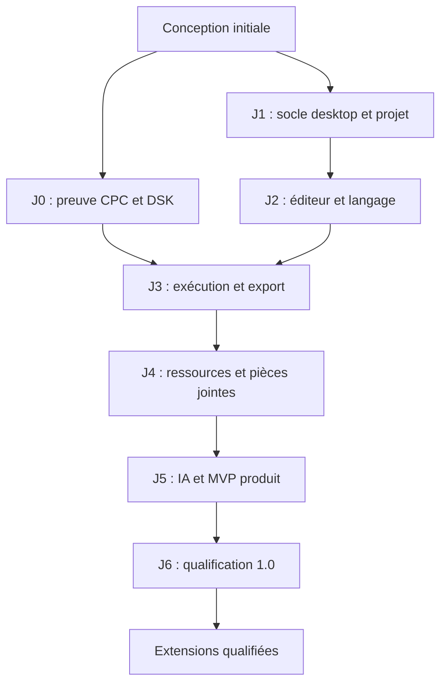

# 12 — Feuille de route et backlog de réalisation

## Mode de progression

J0 reste en HOLD pour la qualification moteur. Une tranche indépendante J1/J2 livre l'[alpha d'édition 0.4](../implementation/editor-alpha.md), conformément à l'[ADR 0009](../adr/0009-edition-independante.md) : elle n'annonce pas J1/J2 complets. Le [rapport J0](../implementation/j0-report.md) conserve les preuves et limites. Chaque jalon dispose d'une branche, d'une PR ciblée, de documents actualisés et d'une démonstration reproductible. Aucun planning calendaire ou volume horaire n'est fixé sans estimation de l'équipe et disponibilité des dépendances.

## J0 — Lever les risques d'exécution et de livraison

Livrer un harness minimal, pas un IDE. Figer le cœur C et Emscripten, importer des ROM autorisées, construire un DSK ASCII, booter, exécuter et extraire les écritures disque. Mesurer les points sensibles du moteur. Vérifier le disque dans un émulateur indépendant.

| Tâche | Dépendance | Critère de sortie |
| --- | --- | --- |
| J0-01 — Audit du cœur et licences, pin de commit | Aucune | Inventaire, limites, hashes et procédure de build |
| J0-02 — Wrapper WASM et validation binaire | J0-01 | Boot qualifié, erreurs d'entrée sans crash |
| J0-03 — Writer/reader DATA minimal | Aucune | DSK hello structurellement valide et déterministe |
| J0-04 — RUN, clavier, vidéo, son et contrôle | J0-02, J0-03 | ACC-08/09/24 techniques documentés |
| J0-05 — OPENOUT et sérialisation disque modifié | J0-04 | Fichier écrit relu dans émulateur indépendant |
| J0-06 — Rapport go/no-go moteur | Tous J0 | Écarts classés, ADR confirmée ou remplacée |

Condition d'arrêt pour l'intégration de l'exécution : pas de ROM utilisable, pas de lecture DSK fiable, pas de récupération des écritures nécessaires ou performances insuffisantes non résolues. Un résultat no-go donne un rapport exploitable et une alternative. L'édition indépendante est autorisée par l'ADR 0009, sans supposer une compatibilité moteur. Le harness reste un banc local, pas un Site hébergé.

## J1 — Socle desktop et projets

Fixer versions de runtime, installer monorepo, shell Electron sécurisé et composition des modules. Créer/ouvrir/enregistrer le projet hello ; intégrer contrats, résolution de chemins, journal transactionnel et détection de modifications externes. Mettre en place CI code et règles d'import.

| Tâche | Dépendance | Critère de sortie |
| --- | --- | --- |
| J1-01 — Workspaces, builds et qualité | Conception ; ADR 0009 | Versions figées, builds main/preload/renderer/workers distincts |
| J1-02 — Cas d'usage Workspace et manifeste | J1-01 | ACC-01 et contrôles de chemins/existence |
| J1-03 — Sauvegarde, conflits et migrations | J1-02 | ACC-02, reprise multifichier élémentaire |
| J1-04 — Shell et configuration ROM | J1-01 | Sécurité IPC, profil lisible et secrets hors renderer |
| J1-05 — CI architecture | J1-01 | ACC-21 ; domaines testables sans Electron |

Sortie : application ouvrable et projets durables, sans annoncer un éditeur BASIC complet. Les données de test ne contiennent aucun secret ou firmware redistribué sans droit.

## J2 — Éditeur BASIC utile

Intégrer Monaco, coloration et services de langage qualifiés. Développer lexer/parser avec fixtures prioritaires et zones opaques explicites. Relier diagnostics à la source. Fournir renumérotation sûre et aide contextualisée.

| Tâche | Dépendance | Critère de sortie |
| --- | --- | --- |
| J2-01 — Modèles Monaco et buffers | J1 | ACC-03, dirty state et annulation |
| J2-02 — Lexer/parser et diagnostic | J2-01 | ACC-04, analyse partielle non destructrice |
| J2-03 — Commandes et profils de langage | J2-02 | Fiches sourcées et variantes prouvées |
| J2-04 — Références et renumérotation | J2-02 | ACC-05, collisions et révision vérifiées |
| J2-05 — Corpus initial, index et fiches de langage | J2-02 | ACC-30 : sources conservées, couverture et qualification explicites |

Sortie : l'utilisateur peut écrire et comprendre un listing réel. Le parser n'est pas réputé complet parce que quelques programmes se colorent correctement.

## J3 — Boucle locale complète

Brancher le pipeline de construction et le moteur qualifiés dans l'UI. Construire depuis une révision, contrôler le cycle de session, afficher catalogue et rapport, exporter source et DSK. Importer/inspecter les DSK supportés. Mettre en évidence disquette construite et copie de session.

| Tâche | Dépendance | Critère de sortie |
| --- | --- | --- |
| J3-01 — BuildPlan, budget et erreurs | J2, codecs J0 | ACC-06/07 |
| J3-02 — Session, machine et focus | J3-01, wrapper J0 | ACC-08/09 intégrés |
| J3-03 — Observations runtime prudentes | J3-02 | ACC-10 avec provenance |
| J3-04 — Exports, import DSK et session mutable | J3-02 | ACC-11/12, source externe intacte |
| J3-05 — Parcours offline | Tous J3 | ACC-20 ; démonstration hello de bout en bout |

Sortie : alpha locale sans IA. Une régression du format disque bloque la sortie de ce jalon, même si l'écran du moteur intégré paraît correct.

## J4 — Images, documents et ressources

Ajouter bibliothèque d'import avec rôles, empreintes, aperçus et limites. Intégrer PDF.js en worker. Fournir sélection de pages/texte et conversion écran CPC modes 0/1/2. Insérer les instructions d'intégration par proposition locale.

| Tâche | Dépendance | Critère de sortie |
| --- | --- | --- |
| J4-01 — Import immuable et previews sûres | J3 | TXT/MD/PNG/JPEG/WebP/PDF et quotas |
| J4-02 — PDF texte et pages | J4-01 | Corpus scanné/chiffré/colonnes et annulation |
| J4-03 — Conversion écran et recettes | J4-01 | Mires exactes, hashes et palette déterministes |
| J4-04 — Build des ressources et proposition d'intégration | J4-03 | ACC-13 et affichage dans émulateur indépendant |

Sortie : ressources embarquées et contexte multimodal prêts, sans IA réseau implicite.

## J5 — Assistance IA et MVP produit

Implémenter le runner de missions, les outils fichiers/références/documents/ressources/build/émulateur, le premier fournisseur à tool calling, configuration de clé et scope de transmission. Le mode Agent crée, modifie, construit, teste et corrige automatiquement dans ses budgets. Ajouter journal, checkpoints, idempotence, steering et modes Revue/Explication. L'éditeur, la machine et le DSK restent fonctionnels quand l'IA échoue.

| Tâche | Dépendance | Critère de sortie |
| --- | --- | --- |
| J5-01 — Runner, registre outils et faux fournisseur | J4 | Boucle multifichier et droits testables sans facturation |
| J5-02 — Scope, contexte progressif et références BASIC | J5-01, J2-05 | Lectures pertinentes, transmission traçable et capacités |
| J5-03 — Adaptateur réel et secret système | J5-02 | ACC-15/22, clé de session disponible |
| J5-04 — Journal, checkpoints, transactions et mode Revue | J5-01, J1-03 | ACC-18/29, concurrence, idempotence et retour arrière |
| J5-05 — Contrôle de mission et essais CPC | J5-01, J3 | ACC-27/28 : correction, steering, stagnation et limites |
| J5-06 — Parcours MVP agentique | Tous J5 précédents | ACC-26/30 : créer avec texte/image/PDF, tester, corriger et préparer DSK |

Sortie : MVP correspondant à l'intention initiale. Une clé de fournisseur nécessaire à un essai réel est une dépendance à fournir ; son absence ne transforme pas un faux adaptateur en test réel réussi.

## J6 — Version 1.0 qualifiée

Renforcer crash recovery, accessibilité, performances et docs utilisateur. Construire les paquets sur plateformes ciblées, signer les diffusions officielles lorsque certificats disponibles, qualifier installation et export indépendant. Définir support et comportement de mise à jour. Rejouer les scénarios du MVP affectés par ces travaux.

| Tâche | Dépendance | Critère de sortie |
| --- | --- | --- |
| J6-01 — Incidents et reprise | J5 | ACC-14 et absence de perte silencieuse |
| J6-02 — Accessibilité et mesures | J5 | ACC-23/24 et rapport d'écarts |
| J6-03 — Packaging et installation | J6-01 | ACC-25 sur Windows propre |
| J6-04 — Recette finale et guide utilisateur | Tous J6 | Traçabilité exigences/preuves, compatibilité annoncée exacte |

Sortie : Windows 1.0. Les paquets Linux/macOS peuvent être diffusés en preview jusqu'à leur propre recette ; leur statut est visible.

## Après 1.0

Priorités proposées : BASIC tokenisé et import de listings anciens ; debugger BASIC qualifié ; CPC 464/DDI-1 puis 664 ; deuxième fournisseur et modèles locaux ; sprites/tilemaps et caractères personnalisés ; assembleur Z80 avec appels BASIC ; snapshots SNA publics ; profils Plus si un cœur ASIC approprié est choisi. Chaque extension possède ADR, exigences et tests propres. L'architecture prépare les ports sans développer dès maintenant ces fonctions.

## Définition de terminé d'un incrément

Le cas d'usage demandé fonctionne, ses invariants ont des preuves, les documents reflètent le code final, la CI pertinente passe, les limites sont explicites et la démonstration est reproductible. La PR expose comportement final et validations. Ne pas multiplier les tests qui répètent une implémentation ; privilégier contrats, frontières, cas limites et parcours à risque.

La tranche [projets BASIC 0.5](../implementation/projects-alpha.md) livre une partie de J1-02/J2-01 : manifeste, dossiers, buffers indépendants, sauvegarde active et DSK multifichier. Pas de journal/recovery ni de clôture J1-03. Prochaine tranche indépendante : sauvegarde coordonnée, checkpoints et récupération, puis enrichissement du langage. La qualification ROM de J0 reste requise avant la boucle d'exécution J3. Les ressources et l'agent restent indispensables au MVP.
