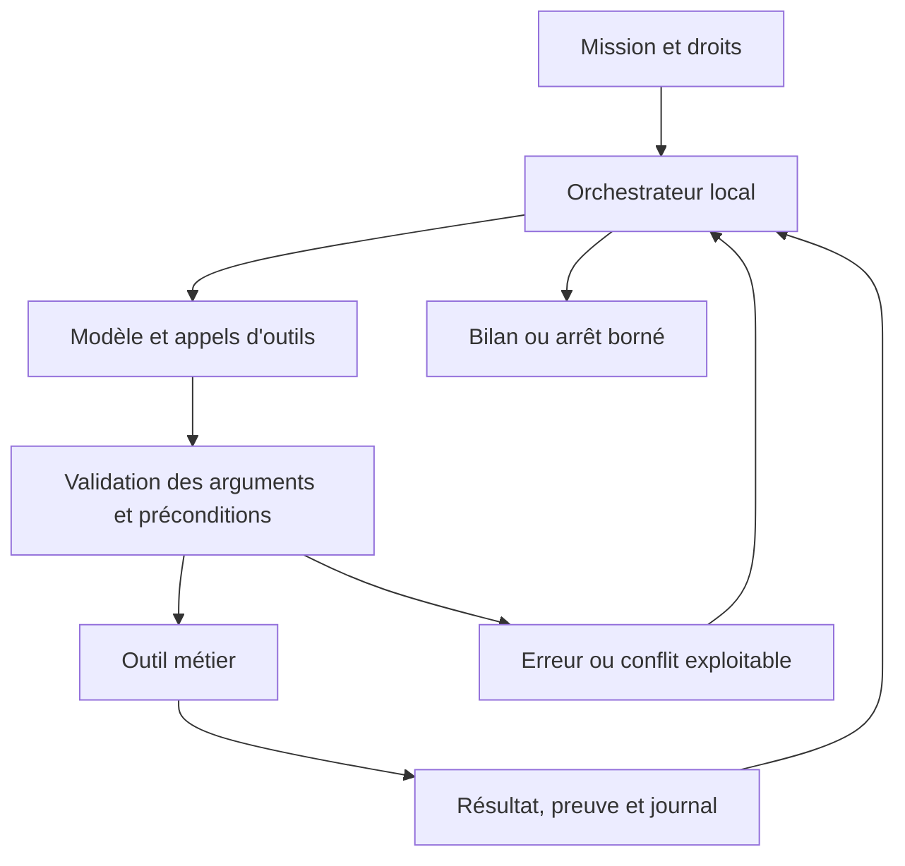

# 14 — Missions, outils et boucle agentique

## Contrat d'une mission

Une mission doit transformer un objectif en travail réel sur le projet. Elle n'est pas une conversation qui renvoie seulement un listing. L'utilisateur doit pouvoir écrire « crée ce jeu en mode 1 à partir de ce PDF, utilise cette image comme écran de titre et teste le démarrage » ; l'agent effectue les opérations utiles, dans les limites de la machine et de son périmètre.

Le [contrat AgentTask](../../contracts/agent-task.schema.json) porte identité, objectif, projet, mode, révision de départ, corpus, scope, outils et budget. Les fichiers concernés ne sont pas nécessairement tous connus avant le premier tour : l'exploration est un outil. Les droits portent un périmètre et des catégories d'opérations, pas une liste artificiellement figée de tous les extraits futurs.

Un seul agent mutatif est actif par projet. Les lectures indépendantes sont parallélisables ; écritures, conversions publiant des ressources, lancements machine et application de consignes sont ordonnés. Le MVP n'a pas besoin de sous-agents concurrents. Le port fournisseur peut plus tard évoluer sans changer ce verrou d'écriture.

## Catalogue d'outils MVP

Chaque outil possède schéma d'entrée/sortie, timeout, quotas, `callId`, références d'objet et erreurs stables. Les noms sont des contrats proposés, à implémenter et figer au jalon J5. Aucun outil n'accepte une commande shell arbitraire.

| Outil | Entrées essentielles | Résultat et règle |
| --- | --- | --- |
| `project.list_files` | Catégorie, préfixe, pagination | IDs, chemins, tailles, hashes ; aucune lecture hors scope |
| `project.search` | Motif littéral ou regex bornée, catégories | Extraits et plages ; résultats et temps limités |
| `project.read_file` | ID/chemin autorisé, plage | Texte/metadata, hash et version ; binaire par handle |
| `project.create_source` | Chemin, nom CPC, contenu | Source + manifeste, transaction ; destination absente |
| `project.replace_source` | ID, hash de base, contenu | Nouveau hash et diff ; conflit si modification concurrente |
| `project.rename_source` | ID, baseHash, nouveau chemin/nom CPC | Manifeste et références de fichiers statiques mises à jour ou avertissement |
| `project.remove_source` | ID, baseHash, motif | Suppression réversible seulement dans le scope et sans casser l'entrée ; checkpoint requis |
| `reference.search` | Sujet/commande, dialecte | Fiches et provenance ; correspondances qualifiées séparées |
| `reference.read` | ID de fiche/source, section/plage | Signature, paramètres, contraintes, exemples et statut |
| `documents.read_text` | Document autorisé, pages/plages | Extraits, pages et extraction effective |
| `documents.inspect_image` | Document autorisé | Image nettoyée, dimensions et métadonnées utiles |
| `documents.render_pdf_pages` | Document, pages, résolution bornée | Images de pages et limites ; pas d'exécution PDF |
| `assets.convert_screen` | Document/recette, mode, palette, destination | Ressource déterministe, aperçu, mémoire et instructions utiles |
| `assets.inspect` | Ressource | Taille, adresse, palette, fraîcheur de recette |
| `language.analyze` | Documents/révision | Diagnostics et couverture d'analyse |
| `language.renumber` | ID, hash, paramètres | Transformation sûre et transaction en mode Agent |
| `build.project` | Révision/options autorisées | Rapport réel et handles d'artefacts, ou échec |
| `emulator.run_build` | Build, profil et durée max | Session et révision effectivement lancée |
| `emulator.send_input` | Session, touches/texte/joystick, durée | Entrée exécutée et horodatage émulé |
| `emulator.observe` | Session, signaux et délai borné | Frame, observation VDU/ROM, fichiers et confiance |
| `emulator.control` | Pause/reprise/ESC/reset | État réel ; disque mutable checkpointer avant remplacement |
| `artifacts.prepare_export` | Build ou copie de session | DSK dans sorties du projet, rapport ; aucune publication externe |
| `task.checkpoint` | Label et révision | Checkpoint durable identifié |

La suppression d'une source préexistante ne découle pas d'une instruction trouvée dans une ressource. Elle est permise si la catégorie figure dans la politique de mission et sert l'objectif utilisateur, avec restauration possible. Les documents originaux et les ROM ne disposent d'aucun outil de suppression en mode Agent. Une suppression non réversible ou une opération extérieure doit recevoir l'autorisation correspondante.

## Orchestration et préconditions

Le modèle suggère une opération ; le runner décide si elle est admissible selon le contrat. Une opération autorisée ne provoque pas une demande utilisateur supplémentaire. Un dépassement de scope est renvoyé comme erreur et ne transforme pas le texte du modèle en permission. Les résultats portent révision et handles valides ; les objets périmés exigent relecture.

Les erreurs comprennent `scope-denied`, `stale-read`, `destination-exists`, `invalid-basic`, `resource-missing`, `firmware-missing`, `unsupported-capability`, `timeout`, `quota-exceeded` et `session-faulted`. Les erreurs corrigeables reviennent au modèle dans les budgets. L'outil distingue résultat connu et observation inconnue. Une sortie abrégée annonce la pagination et ne fait pas passer un catalogue tronqué pour complet.

## Transactions et changements invalides

Une étape de code peut provisoirement rendre le programme non exécutable pendant sa construction : c'est normal dans une mission qui crée plusieurs éléments. L'IDE ne refuse pas toute écriture au premier diagnostic, mais conserve checkpoint et état « en cours ». Les invariants de sécurité, chemins, manifeste et taille restent bloquants. La construction échoue sur les erreurs certaines du listing ; l'agent peut les réparer dans les étapes suivantes.

Une étape combine les fichiers cohérents nécessaires, sans exposer un manifeste pointant vers un fichier absent. Les edits utilisateur déjà dans les buffers sont intégrés au snapshot de départ ou protégés comme dirty ; ils ne sont pas écrasés parce que le fichier disque est plus ancien. Le runner synchronise les modèles Monaco avec sa transaction et conserve les versions de documents.

Restauration : comparer l'état courant à l'état attendu après la mission, préserver les edits étrangers ou demander leur arbitrage, appliquer une nouvelle transaction puis réanalyser. Le journal des appels reste distinct de Git ; la mission n'a pas besoin de commits automatiques pour être réversible.

## Idempotence et reprise

Le journal stocke `taskId`, `callId`, outil, arguments normalisés, preconditionHash, état d'exécution, transactionId et résultat public. Avant mutation, l'appel est enregistré comme préparé ; après transaction, le résultat durable est associé. Le même `callId` avec arguments différents est refusé. Un appel réussi rejoué retourne son résultat, sans refaire rename, écriture, input ou conversion.

Après crash, un appel préparé mais non confirmé est rapproché du journal transactionnel. Une simple relance n'est pas sûre. La reprise détermine commit/rollback local avant de demander une continuation au fournisseur. Les inputs machine et essais non récupérables sont marqués à rejouer explicitement depuis un état qualifié ; ils ne sont pas prétendus exactly-once sur une machine perdue.

## Budget et arrêt

Valeurs initiales proposées par mission : 20 tours modèle, 100 appels outils, 5 cycles de correction build/essai, 15 minutes de temps actif et 60 000 tokens d'usage agrégé quand mesurables. Le coût maximal en euros est configurable et nullable si le tarif ne peut pas être calculé. Les defaults seront adaptés aux mesures ; une limite atteint un état `paused-limit` avec bilan et option de continuation volontaire.

Une pause utilisateur ne consomme pas le temps actif ; les délais fournisseur restent bornés séparément. Une machine qui attend INPUT ne bloque pas indéfiniment le runner : `observe` a une limite de temps émulé et peut renvoyer « résultat attendu non observé ». Trois répétitions de même diagnostic sur même contenu sans changement pertinent déclenchent une stagnation ; la comparaison porte diagnostics et hashes, pas le style du texte modèle.

La fin `completed` exige un résultat et un bilan de tests. Elle peut signaler des limites de vérification subjective, mais pas un test nécessaire explicitement demandé et non effectué sans le marquer bloqué. Une erreur de firmware donne `blocked`, un échec irrécupérable `failed`, un arrêt utilisateur `cancelled`. Les travaux réussis restent accessibles dans tous ces cas.

## Scénario de bout en bout

Mission : créer un écran de titre à partir d'une image et un mini-jeu décrit dans un PDF. L'agent liste le projet, lit l'entrée, extrait les pages utiles, consulte MODE/INK/LOAD et les flux clavier, crée la recette d'écran et le binaire, modifie MAIN.BAS puis analyse. Un build échoue parce qu'un nom dépasse 8.3 : l'agent renomme par outil et corrige la référence, reconstruit, lance, observe le titre et simule la touche de démarrage.

Il vérifie les critères observables prévus, conserve capture et rapport, et prépare le DSK. Si la qualité du gameplay reste subjective, il l'indique dans le bilan. L'utilisateur n'a pas appliqué manuellement chaque fragment de code ; il peut examiner les changements cumulés ou revenir au checkpoint initial. Aucun PDF original, journal privé ou secret n'apparaît sur la disquette.

## Essais dédiés

La recette couvre une mission multifichier, l'accès progressif à des références, une correction sur un échec réel, la transmission limitée au scope, une consigne pendant un appel, un conflit avec une saisie manuelle, un retry de mutation, une reprise après crash, un blocage ROM et une limite de budget. Un faux fournisseur déterministe permet ces essais en CI ; les essais multimodaux réels restent volontaires et bornés.
